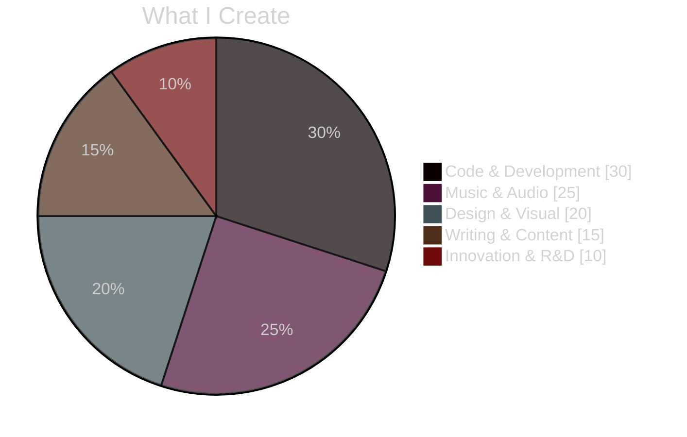

<div align="center">

<!-- HEADER ANIMADO -->


<!-- TYPING ANIMATION -->


<br>

### 🌎 **Broadcasting from Brazil** 🇧🇷


</div>

<br>

<!-- ═══════════════════════════════════════════════════════════════════════════ -->
<!-- ABOUT ME -->
<!-- ═══════════════════════════════════════════════════════════════════════════ -->

<div align="center">

## ✦ ABOUT ME ✦


</div>

<div align="center">

**Sou um criador multidimensional que transita entre código, música e arte visual.**<br>
**Transformo ideias em experiências digitais únicas, combinando tecnologia com criatividade sem limites.**

</div>

<br>

<div align="center">


</div>

<br>

<!-- ═══════════════════════════════════════════════════════════════════════════ -->
<!-- SOCIAL NETWORKS -->
<!-- ═══════════════════════════════════════════════════════════════════════════ -->

<div align="center">

## ✦ CONNECT WITH ME ✦


<br><br>

<!-- MAIN SOCIALS -->
<a href="https://github.com/iakadion"></a>
<a href="https://instagram.com/iakadion"></a>
<a href="https://youtube.com/@iakadion"></a>
<a href="https://twitter.com/iakadion"></a>
<a href="https://soundcloud.com/iakadion"></a>
<a href="https://open.spotify.com/user/31w3syplutlik764wir6lrl4zlum"></a>

<br>

<a href="https://twitch.tv/iakadion"></a>
<a href="https://gitlab.com/akadion"></a>
<a href="https://behance.net/akadion"></a>
<a href="https://dribbble.com/akadion"></a>
<a href="https://medium.com/@akadion"></a>
<a href="https://codepen.io/akadion"></a>

<br>

<a href="https://bsky.app/profile/akadion"></a>
<a href="https://threads.net/@iakadion"></a>
<a href="https://m.facebook.com/profile.php?id=100075107335354"></a>
<a href="https://mastodon.social/@akadion"></a>
<a href="https://reddit.com/u/iakadion"></a>
<a href="https://tumblr.com/akadion"></a>

<br>

<a href="https://beatstars.com/akadion"></a>
<a href="https://suno.com/akadion"></a>
<a href="https://genius.com/akadion"></a>
<a href="https://vimeo.com/akadion"></a>
<a href="https://figma.com/@akadion"></a>
<a href="https://producthunt.com/@akadion"></a>

<br>

<a href="https://steamcommunity.com/id/iakadion"></a>
<a href="https://kick.com/akadion"></a>
<a href="https://wattpad.com/user/iakadion"></a>
<a href="https://wordpress.com/iakadion"></a>
<a href="https://patreon.com/akadion"></a>
<a href="mailto:ogenhoanimation01@gmail.com"></a>

</div>

<br>

<!-- ═══════════════════════════════════════════════════════════════════════════ -->
<!-- TECH STACK -->
<!-- ═══════════════════════════════════════════════════════════════════════════ -->

<div align="center">

## ✦ TECH ARSENAL ✦


<br><br>


<br>


<br>


</div>

<br>

<!-- ═══════════════════════════════════════════════════════════════════════════ -->
<!-- PROJECTS -->
<!-- ═══════════════════════════════════════════════════════════════════════════ -->

<div align="center">

## ✦ LEGENDARY PROJECTS ✦


</div>

<br>

<div align="center">

<!-- ROW 1 -->
<a href="https://github.com/iakadion/akia.js">

</a>

<a href="https://github.com/iakadion/ak-language">

</a>

<a href="https://github.com/iakadion/readgex">

</a>

<br>

<!-- ROW 2 -->
<a href="https://github.com/iakadion/iukka-player">

</a>

<a href="https://github.com/iakadion/shiyo">

</a>

<a href="https://github.com/iakadion/nyx">

</a>

<br>

<!-- ROW 3 -->
<a href="https://github.com/iakadion/akadaion">

</a>

<a href="https://github.com/iakadion/bilbid">

</a>

<a href="https://github.com/iakadion/akash">

</a>

<br>

<!-- ROW 4 -->
<a href="https://github.com/iakadion/fillshy">

</a>

<a href="https://github.com/iakadion/owni">

</a>

</div>

<br>

<!-- ═══════════════════════════════════════════════════════════════════════════ -->
<!-- PROJECT DETAILS -->
<!-- ═══════════════════════════════════════════════════════════════════════════ -->

<details>
<summary align="center"><b>📂 Expandir Detalhes dos Projetos</b></summary>

<br>

<div align="center">

### 🔥 [Akia.js](https://github.com/iakadion/akia.js)
**Renderizador Universal Singleton** que transpila 7+ linguagens<br>
`JavaScript` `TypeScript` `ESNext` `CoffeeScript` `Dart` `Kotlin` `Swift`

---

### ⚡ [.ak Language](https://github.com/iakadion/ak-language)
**Linguagem web proprietária** revolucionando o desenvolvimento moderno<br>
`Compiler Design` `Native Language` `Web Innovation`

---

### 🌐 [readgex](https://github.com/iakadion/readgex)
**Navegador inteligente com IA** e agente autônomo<br>
`React` `TypeScript` `AI` `Autonomous Agent`

---

### 🎵 [IUKKA Player](https://github.com/iakadion/iukka-player)
**Streaming quântico** com tecnologia de ponta<br>
`WebRTC` `Media APIs` `Quantum Processing`

---

### 💼 [SHIYO](https://github.com/iakadion/shiyo)
**Plataforma de portfólio** com integração social<br>
`React` `Node.js` `Social Integration`

---

### 🎨 [NYX](https://github.com/iakadion/nyx)
**Showcase de portfólio criativo** com gráficos 3D<br>
`React` `WebGL` `3D Graphics`

---

### 🏢 [Akadaion](https://github.com/iakadion/akadaion)
**Headquarters institucional** enterprise<br>
`Next.js` `TypeScript` `Enterprise`

---

### 🧠 [Bilbid](https://github.com/iakadion/bilbid)
**Motor de conhecimento semântico** com IA<br>
`AI` `NLP` `Wikipedia API` `Knowledge Graph`

---

### 📊 [akash](https://github.com/iakadion/akash)
**Dashboard universal** para gestão de sites<br>
`Dashboard` `Admin Panel` `Site Management`

---

### ✨ [Fillshy](https://github.com/iakadion/fillshy)
**Gerador de conteúdo IA** em background<br>
`AI` `Content Generation` `Background Processing`

---

### 🎯 [Owni](https://github.com/iakadion/owni)
**Biblioteca de componentes e ícones** multi-linguagem<br>
`SVG` `Animated Icons` `Web Components`

</div>

</details>

<br>

<!-- ═══════════════════════════════════════════════════════════════════════════ -->
<!-- STATS -->
<!-- ═══════════════════════════════════════════════════════════════════════════ -->

<div align="center">

## ✦ GITHUB STATS ✦


<br><br>


<br>


<br>


</div>

<br>

<!-- ═══════════════════════════════════════════════════════════════════════════ -->
<!-- TROPHIES -->
<!-- ═══════════════════════════════════════════════════════════════════════════ -->

<div align="center">

## ✦ ACHIEVEMENTS ✦

[](https://github.com/ryo-ma/github-profile-trophy)

</div>

<br>

<!-- ═══════════════════════════════════════════════════════════════════════════ -->
<!-- SKILLS CHART -->
<!-- ═══════════════════════════════════════════════════════════════════════════ -->

<div align="center">

## ✦ CREATION DISTRIBUTION ✦



</div>

<br>

<!-- ═══════════════════════════════════════════════════════════════════════════ -->
<!-- PHILOSOPHY -->
<!-- ═══════════════════════════════════════════════════════════════════════════ -->

<div align="center">

## ✦ PHILOSOPHY ✦


<br><br>

### *"Create. Innovate. Inspire. Repeat."*

```typescript
class Creator {
  readonly passion = Infinity;
  readonly innovation = "∞";
  readonly determination = true;
  
  async create(): Promise<Masterpiece> {
    while(this.passion > 0) {
      await this.innovate();
      await this.inspire();
      await this.learn();
    }
    return new Masterpiece();
  }
}

const genho = new Creator();
genho.create(); // Never stops
```

</div>

<br>

<!-- ═══════════════════════════════════════════════════════════════════════════ -->
<!-- SNAKE -->
<!-- ═══════════════════════════════════════════════════════════════════════════ -->

<div align="center">

## ✦ CONTRIBUTION SNAKE ✦


</div>

<br>

<!-- ═══════════════════════════════════════════════════════════════════════════ -->
<!-- FUN FACTS -->
<!-- ═══════════════════════════════════════════════════════════════════════════ -->

<details>
<summary align="center"><b>🎲 Fun Facts & Easter Eggs</b></summary>

<div align="center">

<br>


<br><br>

🌎 Based in vibrant **Brazil** 🇧🇷

🎵 Can create a full track while debugging code

🎬 Dreams in cinematic sequences

💻 Writes code like poetry

🎨 Designs with emotion

⚡ Powered by coffee and creativity

🚀 Believes in the impossible

🎯 Multi-dimensional thinking is my superpower

</div>

</details>

<br>

<!-- ═══════════════════════════════════════════════════════════════════════════ -->
<!-- SUPPORT -->
<!-- ═══════════════════════════════════════════════════════════════════════════ -->

<div align="center">

## ✦ SUPPORT MY WORK ✦


<br><br>

If you love what I create, consider supporting me!

<br>

<a href="https://patreon.com/akadion"></a>
<a href="mailto:ogenhoanimation01@gmail.com"></a>

</div>

<br>

<!-- ═══════════════════════════════════════════════════════════════════════════ -->
<!-- VISITOR COUNT -->
<!-- ═══════════════════════════════════════════════════════════════════════════ -->

<div align="center">


<br>

[](https://github.com/iakadion)

</div>

<br>

<!-- ═══════════════════════════════════════════════════════════════════════════ -->
<!-- FOOTER -->
<!-- ═══════════════════════════════════════════════════════════════════════════ -->

<div align="center">

### 🌟 *"The future belongs to those who create it"* 🌟

<br>


**⚡ Built with passion, powered by creativity ⚡**

**🚀 Let's create the future together! 🚀**

</div>
