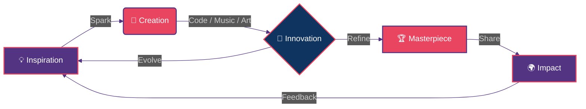

<div align="center">

<!-- ═══════════════════════════════════════════════════════════════ -->
<!-- 🌌 HEADER: COSMIC WAVE + ANIMATED TYPING                      -->
<!-- ═══════════════════════════════════════════════════════════════ -->


<!-- ANIMATED TYPING ROLES -->
<a href="https://git.io/typing-svg">
  
</a>

<br/>

<!-- LOCATION + STATUS -->

&nbsp;

&nbsp;


<br/><br/>

<!-- ANIMATED DIVIDER -->


</div>

<!-- ═══════════════════════════════════════════════════════════════ -->
<!-- 🎭 ABOUT ME SECTION                                            -->
<!-- ═══════════════════════════════════════════════════════════════ -->

<br/>

<div align="center">

##  &nbsp; **THE CREATOR** &nbsp; 

</div>

<br/>

<table align="center" border="0" cellpadding="0" cellspacing="0">
<tr>
<td width="50%" valign="top">

<div align="center">


</div>

</td>
<td width="50%" valign="top">

<div align="left">

### 🌌 **Who is Genho Akadion?**

> *A multi-dimensional creator navigating the intersection where **Code**, **Music**, and **Visual Art** collide into something extraordinary.*

<br/>

🎸 **`MUSIC`** — Musician · Artist · Lyricist · Engineer · Producer

💻 **`TECH`** — Programmer · Full-Stack Dev · Language Designer

🎬 **`CINEMA`** — Filmmaker · Director · Visual Storyteller

🎨 **`DESIGN`** — Visual Artist · UI/UX · 3D Graphics

✍️ **`WRITING`** — Writer · Worldbuilder · Narrative Designer

🎮 **`GAMES`** — Game Developer · Interactive Experiences

🚀 **`INNOVATION`** — Inventor · Architect · Visionary

</div>

</td>
</tr>
</table>

<br/>

<div align="center">

```
╔══════════════════════════════════════════════════════════════════╗
║                                                                  ║
║   "I don't choose between disciplines — I merge them.            ║
║    Every line of code is a verse. Every melody is an algorithm.   ║
║    Every frame is a function. Creation has no boundaries."        ║
║                                                                  ║
║                                          — Genho Akadion         ║
╚══════════════════════════════════════════════════════════════════╝
```


</div>

<!-- ═══════════════════════════════════════════════════════════════ -->
<!-- 📡 CONNECT SECTION                                             -->
<!-- ═══════════════════════════════════════════════════════════════ -->

<br/>

<div align="center">

##  &nbsp; **CONNECT WITH ME** &nbsp; 

<br/>

<!-- ─── 🎵 MUSIC & AUDIO ─── -->

<details open>
<summary><h3>🎵 &nbsp; SOUND & FREQUENCY</h3></summary>
<br/>

<a href="https://soundcloud.com/iakadion"></a>
<a href="https://open.spotify.com/user/31w3syplutlik764wir6lrl4zlum"></a>
<a href="https://beatstars.com/akadion"></a>
<a href="https://soundverse.com/akadion"></a>
<a href="https://suno.com/akadion"></a>
<a href="https://genius.com/akadion"></a>

</details>

<!-- ─── 📱 SOCIAL MEDIA ─── -->

<details open>
<summary><h3>📱 &nbsp; SOCIAL & MEDIA</h3></summary>
<br/>

<a href="https://instagram.com/iakadion"></a>
<a href="https://youtube.com/@iakadion"></a>
<a href="https://twitter.com/iakadion"></a>
<a href="https://twitch.tv/iakadion"></a>
<a href="https://m.facebook.com/profile.php?id=100075107335354"></a>
<a href="https://threads.net/@iakadion"></a>
<a href="https://bsky.app/profile/akadion"></a>
<a href="https://reddit.com/u/iakadion"></a>

</details>

<!-- ─── 💻 DEV PLATFORMS ─── -->

<details open>
<summary><h3>💻 &nbsp; CODE & DEVELOPMENT</h3></summary>
<br/>

<a href="https://github.com/iakadion"></a>
<a href="https://gitlab.com/akadion"></a>
<a href="https://codepen.io/akadion"></a>
<a href="https://stackoverflow.com/users/akadion"></a>
<a href="https://replit.com/@akadion"></a>
<a href="https://hub.docker.com/u/akadion"></a>

</details>

<!-- ─── 🎨 CREATIVE PLATFORMS ─── -->

<details open>
<summary><h3>🎨 &nbsp; CREATIVE & WRITING</h3></summary>
<br/>

<a href="https://behance.net/akadion"></a>
<a href="https://dribbble.com/akadion"></a>
<a href="https://figma.com/@akadion"></a>
<a href="https://medium.com/@akadion"></a>
<a href="https://wordpress.com/iakadion"></a>

</details>

<!-- ─── 🚀 SUPPORT & CONTACT ─── -->

<details open>
<summary><h3>🚀 &nbsp; SUPPORT & CONTACT</h3></summary>
<br/>

<a href="https://producthunt.com/@akadion"></a>
<a href="https://patreon.com/akadion"></a>
<a href="mailto:ogenhoanimation01@gmail.com"></a>

</details>

<br/>


</div>

<!-- ═══════════════════════════════════════════════════════════════ -->
<!-- 🛠️ TECH ARSENAL                                                -->
<!-- ═══════════════════════════════════════════════════════════════ -->

<br/>

<div align="center">

##  &nbsp; **TECH ARSENAL** &nbsp; 

<br/>

<!-- LANGUAGES -->
<h3>⚡ Languages</h3>


<br/><br/>

<!-- FRONTEND -->
<h3>🎨 Frontend & UI</h3>


<br/><br/>

<!-- BACKEND & DATABASE -->
<h3>⚙️ Backend & Database</h3>


<br/><br/>

<!-- TOOLS & INFRA -->
<h3>🔧 Tools & Infrastructure</h3>


<br/><br/>

<!-- CREATIVE TOOLS -->
<h3>🎬 Creative & Design</h3>


<br/><br/>

<!-- BUILD TOOLS -->
<h3>📦 Build & Dev Tools</h3>


<br/>


</div>

<!-- ═══════════════════════════════════════════════════════════════ -->
<!-- 🚀 PROJECTS SECTION                                            -->
<!-- ═══════════════════════════════════════════════════════════════ -->

<br/>

<div align="center">

##  &nbsp; **LEGENDARY PROJECTS** &nbsp; 

<br/>


</div>

<br/>

<!-- PROJECT GRID -->

<table align="center" border="0">
<tr>
<td width="50%">

<details open>
<summary><b>🔥 Akia.js — Universal Renderer</b></summary>
<br/>

> **Singleton renderer transpiling 7+ languages with native innovation.**

| | |
|---|---|
| **Stack** | `JavaScript` `ESNext` `Transpiler` `Compiler` |
| **Type** | 🧬 Core Engine / Framework |
| **Status** |  |

</details>

</td>
<td width="50%">

<details open>
<summary><b>⚡ .ak Language — Proprietary Web Lang</b></summary>
<br/>

> **The future of web development. Native compiler for modern revolution.**

| | |
|---|---|
| **Stack** | `Compiler Design` `Native Lang` `Web Innovation` |
| **Type** | 🧬 Programming Language |
| **Status** |  |

</details>

</td>
</tr>

<tr>
<td width="50%">

<details open>
<summary><b>🌐 Readgex — AI-Powered Browser</b></summary>
<br/>

> **Smart autonomous agent with browser integration.**

| | |
|---|---|
| **Stack** | `React` `TypeScript` `AI` `Autonomous Agent` |
| **Type** | 🤖 AI Application |
| **Status** |  |

</details>

</td>
<td width="50%">

<details open>
<summary><b>🧠 Bilbid — Semantic Knowledge Engine</b></summary>
<br/>

> **Intelligent knowledge graph with NLP-powered understanding.**

| | |
|---|---|
| **Stack** | `AI` `NLP` `Wikipedia API` `Knowledge Graph` |
| **Type** | 🧬 AI / Data Engine |
| **Status** |  |

</details>

</td>
</tr>

<tr>
<td width="50%">

<details>
<summary><b>🎵 IUKKA Player — Quantum Streaming</b></summary>
<br/>

> **Next-gen streaming player with quantum-inspired processing.**

| | |
|---|---|
| **Stack** | `WebRTC` `Media APIs` `Audio Engine` |
| **Type** | 🎵 Media Player |

</details>

</td>
<td width="50%">

<details>
<summary><b>💼 SHIYO — Social Media Portfolio</b></summary>
<br/>

> **Unified social media portfolio platform.**

| | |
|---|---|
| **Stack** | `React` `Node.js` `Social APIs` |
| **Type** | 📱 Platform |

</details>

</td>
</tr>

<tr>
<td width="50%">

<details>
<summary><b>🎨 NYX — Creative Portfolio Showcase</b></summary>
<br/>

> **Immersive 3D portfolio experience.**

| | |
|---|---|
| **Stack** | `React` `WebGL` `Three.js` `3D Graphics` |
| **Type** | 🎨 Portfolio |

</details>

</td>
<td width="50%">

<details>
<summary><b>🏢 Akadaion — Institutional HQ</b></summary>
<br/>

> **Enterprise-grade institutional headquarters.**

| | |
|---|---|
| **Stack** | `Next.js` `TypeScript` `Enterprise` |
| **Type** | 🏛️ Enterprise |

</details>

</td>
</tr>

<tr>
<td width="50%">

<details>
<summary><b>📊 Akash — Universal Dashboard</b></summary>
<br/>

> **All-in-one admin panel and site management.**

| | |
|---|---|
| **Stack** | `Dashboard` `Admin Panel` `Analytics` |
| **Type** | 📊 Dashboard |

</details>

</td>
<td width="50%">

<details>
<summary><b>✨ Fillshy — AI Content Generator</b></summary>
<br/>

> **Background AI-powered content generation engine.**

| | |
|---|---|
| **Stack** | `AI` `ML` `Content Gen` `Background Processing` |
| **Type** | 🤖 AI Tool |

</details>

</td>
</tr>

<tr>
<td colspan="2" align="center">

<details>
<summary><b>🎯 Owni — Component & Icon Library</b></summary>
<br/>

> **Custom animated icon system and web component library.**

| | |
|---|---|
| **Stack** | `OWM` `Animated Icons` `Web Components` `SVG` |
| **Type** | 📦 Library |

</details>

</td>
</tr>
</table>

<br/>

<div align="center">


</div>

<!-- ═══════════════════════════════════════════════════════════════ -->
<!-- 📊 GITHUB STATS                                                -->
<!-- ═══════════════════════════════════════════════════════════════ -->

<br/>

<div align="center">

##  &nbsp; **GITHUB ANALYTICS** &nbsp; 

<br/>

<!-- STATS ROW 1 -->
<p>

&nbsp;

</p>

<!-- STREAK -->


<br/><br/>

<!-- ACTIVITY GRAPH -->


<br/>


</div>

<!-- ═══════════════════════════════════════════════════════════════ -->
<!-- 🧠 PHILOSOPHY SECTION                                          -->
<!-- ═══════════════════════════════════════════════════════════════ -->

<br/>

<div align="center">

## 🧠 &nbsp; **WORKFLOW & PHILOSOPHY** &nbsp; 🧠

<br/>



<br/>

```typescript
// ═══════════════════════════════════════════
//  🧬 THE INFINITE LOOP OF CREATION
// ═══════════════════════════════════════════

class GenhoAkadion extends MultiDimensionalCreator {
  readonly dimensions = ['Code', 'Music', 'Film', 'Art', 'Writing', 'Games'];
  readonly philosophy = 'Create. Innovate. Inspire. Repeat.';
  
  async live(): Promise<void> {
    while (this.isAlive) {
      const idea = await this.imagine();
      const creation = await this.build(idea);
      const masterpiece = await this.refine(creation);
      await this.shareWithTheWorld(masterpiece);
    }
  }
}

new GenhoAkadion().live(); // ⚡ Running since day one...
```

<br/>


<br/>


</div>

<!-- ═══════════════════════════════════════════════════════════════ -->
<!-- 🐍 CONTRIBUTION SNAKE                                          -->
<!-- ═══════════════════════════════════════════════════════════════ -->

<br/>

<div align="center">

## 🐍 &nbsp; **CONTRIBUTION SNAKE** &nbsp; 🐍

<br/>

<picture>
  <source media="(prefers-color-scheme: dark)" srcset="https://raw.githubusercontent.com/iakadion/iakadion/output/github-contribution-grid-snake-dark.svg" />
  <source media="(prefers-color-scheme: light)" srcset="https://raw.githubusercontent.com/iakadion/iakadion/output/github-contribution-grid-snake.svg" />
  
</picture>

<br/>


</div>

<!-- ═══════════════════════════════════════════════════════════════ -->
<!-- 🏆 ACHIEVEMENTS                                                -->
<!-- ═══════════════════════════════════════════════════════════════ -->

<br/>

<div align="center">

## 🏆 &nbsp; **TROPHY CASE** &nbsp; 🏆

<br/>


<br/><br/>

<!-- METRICS -->

<table border="0">
<tr>
<td align="center">

</td>
<td align="center">

</td>
<td align="center">

</td>
</tr>
</table>

<br/>

<!-- VISITOR COUNTER -->


<br/><br/>


</div>

<!-- ═══════════════════════════════════════════════════════════════ -->
<!-- 🌟 SPOTIFY / NOW PLAYING (OPTIONAL)                            -->
<!-- ═══════════════════════════════════════════════════════════════ -->

<br/>

<div align="center">

## 🎧 &nbsp; **CURRENTLY VIBING** &nbsp; 🎧

<br/>

<a href="https://open.spotify.com/user/31w3syplutlik764wir6lrl4zlum">
  
</a>

</div>

<br/>

<!-- ═══════════════════════════════════════════════════════════════ -->
<!-- 🌌 FOOTER                                                      -->
<!-- ═══════════════════════════════════════════════════════════════ -->

<div align="center">


<br/>


<br/><br/>

**`© 2026 Genho Akadion — All Dimensions Reserved`**

</div>
