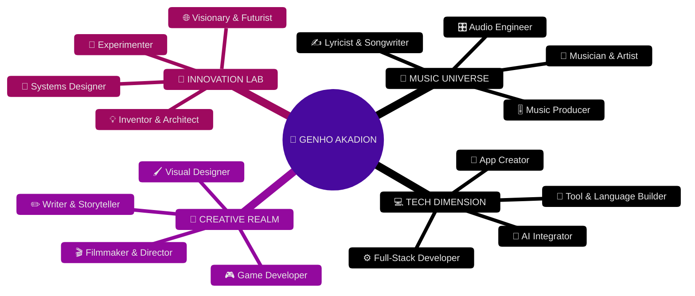
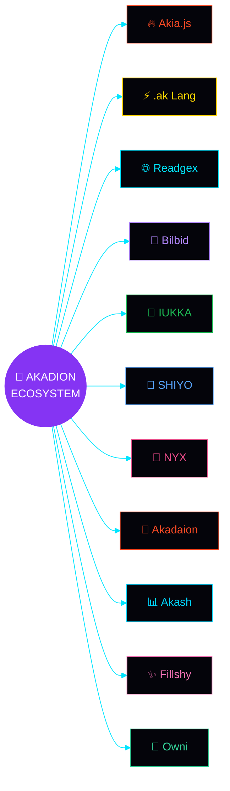
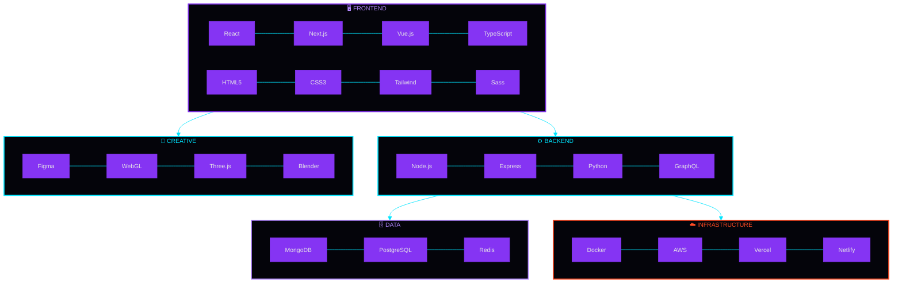
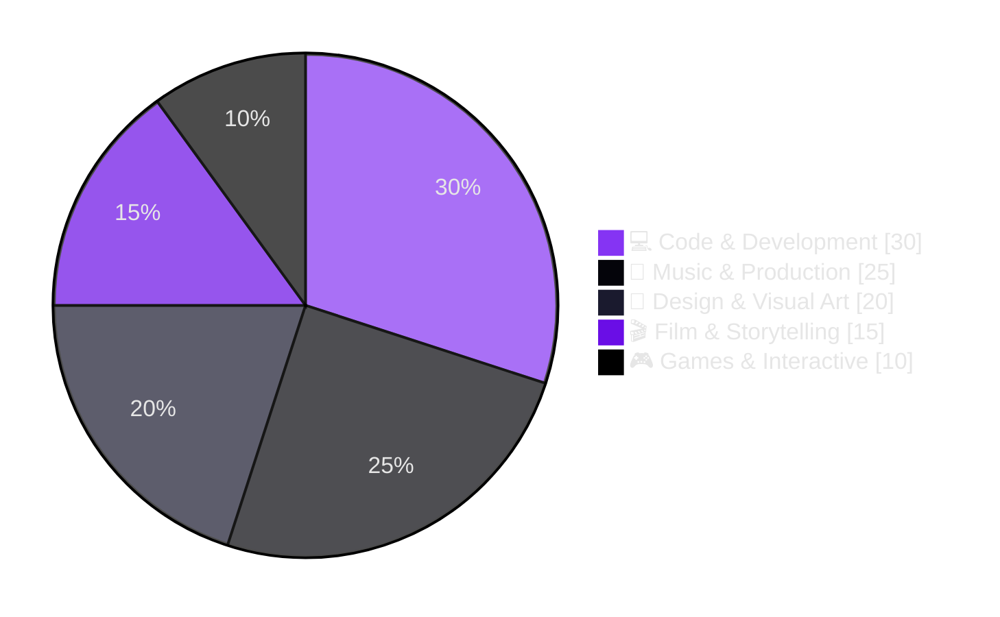
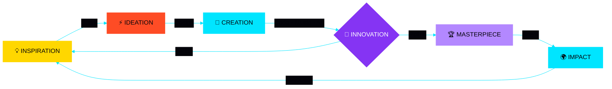

<picture>
  <source media="(prefers-color-scheme: dark)" srcset="https://raw.githubusercontent.com/iakadion/iakadion/main/assets/hero-purple.svg">
  
</picture>

 

 

  

<!-- ═══════════════════════════════════════════════════════════════ -->
<!-- SECTION 1: MANIFESTO                                           -->
<!-- ═══════════════════════════════════════════════════════════════ -->

## ✦ 𝗠𝗔𝗡𝗜𝗙𝗘𝗦𝗧𝗢 ✦

 

<blockquote style="border-left: 3px solid #8534F3; padding: 1.2rem 2rem; background: rgba(133,52,243,0.05); border-radius: 0 16px 16px 0; max-width: 780px; margin: 0 auto; text-align: left;">

"Every pixel, every note, every line of code tells a story. 
I bridge the gap between art and technology — building universes 
where music, film, code, and design converge into a single 
multidimensional experience."

</blockquote>

 

🎵 Musician
💻 Full-Stack Developer
🎬 Filmmaker
🎨 Designer
✍️ Writer
🎮 Game Creator
🔬 Inventor
 🎭 Artist
🚀 Visionary

<!-- ═══════════════════════════════════════════════════════════════ -->
<!-- SECTION 2: WHO IS GENHO AKADION?                              -->
<!-- ═══════════════════════════════════════════════════════════════ -->

## ✦ 𝗪𝗛𝗢 𝗜𝗦 𝗚𝗘𝗡𝗛𝗢 𝗔𝗞𝗔𝗗𝗜𝗢𝗡? ✦

 

<b style="color: #B388FF; font-size: 1.1rem;">🎵 MUSIC UNIVERSE</b>
 
Musician & Artist · Lyricist & Songwriter · Audio Engineer · Music Producer

<b style="color: #00E5FF; font-size: 1.1rem;">💻 TECH DIMENSION</b>
 
Full-Stack Developer · Tool & Language Builder · AI Integrator · App Creator

<b style="color: #FE4C25; font-size: 1.1rem;">🎨 CREATIVE REALM</b>
 
Filmmaker & Director · Visual Designer · Writer & Storyteller · Game Developer

<b style="color: #FE4C25; font-size: 1.1rem;">🚀 INNOVATION LAB</b>
 
Inventor & Architect · Visionary & Futurist · Experimenter · Systems Designer

 

```mermaid
%%{init: {'theme':'base','themeVariables':{'primaryColor':'#8534F3','primaryTextColor':'#E6E6E6','primaryBorderColor':'#8534F3','lineColor':'#00E5FF','secondaryColor':'#04040A','tertiaryColor':'#1a1a2e','fontSize':'13px'}}}%%
mindmap
  root((🌌 GENHO AKADION))
    🎵 MUSIC UNIVERSE
      🎸 Musician & Artist
      ✍️ Lyricist & Songwriter
      🎛️ Audio Engineer
      🎚️ Music Producer
    💻 TECH DIMENSION
      ⚙️ Full-Stack Developer
      🔧 Tool & Language Builder
      🤖 AI Integrator
      📱 App Creator
    🎨 CREATIVE REALM
      🎬 Filmmaker & Director
      🖌️ Visual Designer
      ✏️ Writer & Storyteller
      🎮 Game Developer
    🚀 INNOVATION LAB
      💡 Inventor & Architect
      🌐 Visionary & Futurist
      🧪 Experimenter
      📐 Systems Designer
```

<!-- ═══════════════════════════════════════════════════════════════ -->
<!-- SECTION 3: THE AKADION ECOSYSTEM                               -->
<!-- ═══════════════════════════════════════════════════════════════ -->

## ✦ 𝗧𝗛𝗘 𝗔𝗞𝗔𝗗𝗜𝗢𝗡 𝗘𝗖𝗢𝗦𝗬𝗦𝗧𝗘𝗠 ✦

 

```mermaid
%%{init: {'theme':'base','themeVariables':{'primaryColor':'#8534F3','primaryTextColor':'#E6E6E6','lineColor':'#00E5FF','secondaryColor':'#04040A','tertiaryColor':'#1a1a2e'}}}%%
graph LR
  A((🌌 AKADION<br/>ECOSYSTEM)) --> B[🔥 Akia.js]
  A --> C[⚡ .ak Lang]
  A --> D[🌐 Readgex]
  A --> E[🧠 Bilbid]
  A --> F[🎵 IUKKA]
  A --> G[💼 SHIYO]
  A --> H[🎨 NYX]
  A --> I[🏢 Akadaion]
  A --> J[📊 Akash]
  A --> K[✨ Fillshy]
  A --> L[🎯 Owni]
  style A fill:#8534F3,stroke:#8534F3,color:#fff,stroke-width:3px
  style B fill:#04040A,stroke:#FE4C25,stroke-width:1px,color:#FE4C25
  style C fill:#04040A,stroke:#FFD700,stroke-width:1px,color:#FFD700
  style D fill:#04040A,stroke:#00E5FF,stroke-width:1px,color:#00E5FF
  style E fill:#04040A,stroke:#B388FF,stroke-width:1px,color:#B388FF
  style F fill:#04040A,stroke:#1DB954,stroke-width:1px,color:#1DB954
  style G fill:#04040A,stroke:#58a6ff,stroke-width:1px,color:#58a6ff
  style H fill:#04040A,stroke:#EA4C89,stroke-width:1px,color:#EA4C89
  style I fill:#04040A,stroke:#FE4C25,stroke-width:1px,color:#FE4C25
  style J fill:#04040A,stroke:#00D4FF,stroke-width:1px,color:#00D4FF
  style K fill:#04040A,stroke:#F472B6,stroke-width:1px,color:#F472B6
  style L fill:#04040A,stroke:#34D399,stroke-width:1px,color:#34D399
```

 

<b style="color: #FE4C25; font-size: 1.2rem;">🔥 Akia.js</b>
Universal Singleton Renderer

95%
 
JS · ESNext · Transpiler · Compiler

<b style="color: #FFD700; font-size: 1.2rem;">⚡ .ak Language</b>
Proprietary Web Language

88%
 
Compiler Design · Native Language

<b style="color: #00E5FF; font-size: 1.2rem;">🌐 Readgex</b>
Intelligent AI Browser

82%
 
React · TS · AI · Autonomous Agent

<b style="color: #B388FF; font-size: 1.2rem;">🧠 Bilbid</b>
Semantic Knowledge Engine

87%
 
AI · NLP · Wikipedia API · Knowledge Graph

<b style="color: #1DB954; font-size: 1.2rem;">🎵 IUKKA Player</b>
Quantum Streaming Platform

76%
 
WebRTC · Media APIs · Streaming · Audio Engine

<b style="color: #58a6ff; font-size: 1.2rem;">💼 SHIYO</b>
Social Media Portfolio Platform

70%
 
React · Node.js · Social Integration

<b style="color: #EA4C89; font-size: 1.2rem;">🎨 NYX</b>
Creative Portfolio Showcase

65%
 
React · WebGL · 3D Graphics · GLSL

<b style="color: #FE4C25; font-size: 1.2rem;">🏢 Akadaion</b>
Institutional HQ

80%
 
Next.js · TypeScript · Enterprise

<b style="color: #00D4FF; font-size: 1.2rem;">📊 Akash</b>
Universal Dashboard

73%
 
Dashboard · Admin Panel · Analytics

<b style="color: #F472B6; font-size: 1.2rem;">✨ Fillshy</b>
Background AI Content Generator

68%
 
AI · Content Generation · NLP

<b style="color: #34D399; font-size: 1.2rem;">🎯 Owni</b>
Component & Icon Library

60%
 
Web Components · SVG · Design System

<!-- ═══════════════════════════════════════════════════════════════ -->
<!-- SECTION 4: TECH ARSENAL                                        -->
<!-- ═══════════════════════════════════════════════════════════════ -->

## ✦ 𝗧𝗘𝗖𝗛 𝗔𝗥𝗦𝗘𝗡𝗔𝗟 ✦

 

```mermaid
%%{init: {'theme':'base','themeVariables':{'primaryColor':'#8534F3','primaryTextColor':'#E6E6E6','primaryBorderColor':'#8534F3','lineColor':'#00E5FF','secondaryColor':'#04040A','tertiaryColor':'#1a1a2e','fontSize':'12px'}}}%%
graph TB
  subgraph FRONTEND["🖥️ FRONTEND"]
    direction LR
    R[React] --- N[Next.js] --- V[Vue.js] --- T[TypeScript]
    H[HTML5] --- C[CSS3] --- TW[Tailwind] --- S[Sass]
  end
  subgraph BACKEND["⚙️ BACKEND"]
    direction LR
    NO[Node.js] --- EX[Express] --- PY[Python] --- GQ[GraphQL]
  end
  subgraph INFRA["☁️ INFRASTRUCTURE"]
    direction LR
    D[Docker] --- AW[AWS] --- VR[Vercel] --- NL[Netlify]
  end
  subgraph DATA["🗄️ DATA"]
    direction LR
    MG[MongoDB] --- PG[PostgreSQL] --- RD[Redis]
  end
  subgraph CREATIVE["🎨 CREATIVE"]
    direction LR
    FG[Figma] --- WG[WebGL] --- TJ[Three.js] --- BL[Blender]
  end
  FRONTEND --> BACKEND --> DATA
  BACKEND --> INFRA
  FRONTEND --> CREATIVE
  style FRONTEND fill:#04040A,stroke:#8534F3,stroke-width:2px,color:#B388FF
  style BACKEND fill:#04040A,stroke:#00E5FF,stroke-width:2px,color:#00E5FF
  style INFRA fill:#04040A,stroke:#FE4C25,stroke-width:2px,color:#FE4C25
  style DATA fill:#04040A,stroke:#B388FF,stroke-width:2px,color:#B388FF
  style CREATIVE fill:#04040A,stroke:#00E5FF,stroke-width:2px,color:#00E5FF
```

 

 

 

<!-- ═══════════════════════════════════════════════════════════════ -->
<!-- SECTION 5: CREATOR STATS                                       -->
<!-- ═══════════════════════════════════════════════════════════════ -->

## ✦ 𝗖𝗥𝗘𝗔𝗧𝗢𝗥 𝗦𝗧𝗔𝗧𝗦 ✦

 

<!-- ═══════════════════════════════════════════════════════════════ -->
<!-- SECTION 6: CREATIVE ENERGY                                     -->
<!-- ═══════════════════════════════════════════════════════════════ -->

## ✦ 𝗖𝗥𝗘𝗔𝗧𝗜𝗩𝗘 𝗘𝗡𝗘𝗥𝗚𝗬 ✦

 

```mermaid
%%{init: {'theme':'base','themeVariables':{'primaryColor':'#8534F3','primaryTextColor':'#E6E6E6','lineColor':'#00E5FF','secondaryColor':'#04040A','tertiaryColor':'#1a1a2e'}}}%%
pie showData
  "💻 Code & Development" : 30
  "🎵 Music & Production" : 25
  "🎨 Design & Visual Art" : 20
  "🎬 Film & Storytelling" : 15
  "🎮 Games & Interactive" : 10
```

<!-- ═══════════════════════════════════════════════════════════════ -->
<!-- SECTION 7: WORKFLOW PHILOSOPHY                                 -->
<!-- ═══════════════════════════════════════════════════════════════ -->

## ✦ 𝗪𝗢𝗥𝗞𝗙𝗟𝗢𝗪 ⟐ 𝗣𝗛𝗜𝗟𝗢𝗦𝗢𝗣𝗛𝗬 ✦

 

```mermaid
%%{init: {'theme':'base','themeVariables':{'primaryColor':'#8534F3','primaryTextColor':'#04040A','lineColor':'#00E5FF','secondaryColor':'#04040A','tertiaryColor':'#1a1a2e'}}}%%
flowchart LR
  A["💡 INSPIRATION"] -->|Spark| B["⚡ IDEATION"]
  B -->|Design| C["🔧 CREATION"]
  C -->|Code • Music • Art| D{"🔬 INNOVATION"}
  D -->|Refine| E["🏆 MASTERPIECE"]
  D -->|Iterate| A
  E -->|Share| F["🌍 IMPACT"]
  F -->|Feedback| A
  style A fill:#FFD700,stroke:#FFD700,color:#04040A,stroke-width:2px
  style B fill:#FE4C25,stroke:#FE4C25,color:#04040A,stroke-width:2px
  style C fill:#00E5FF,stroke:#00E5FF,color:#04040A,stroke-width:2px
  style D fill:#8534F3,stroke:#8534F3,color:#fff,stroke-width:2px
  style E fill:#B388FF,stroke:#B388FF,color:#04040A,stroke-width:2px
  style F fill:#00E5FF,stroke:#00E5FF,color:#04040A,stroke-width:2px
```

 

<pre style="background: #04040A; border: 1px solid rgba(133,52,243,0.2); border-radius: 12px; padding: 1.2rem; max-width: 780px; margin: 1rem auto; text-align: left; font-family: 'JetBrains Mono', monospace; font-size: 0.85rem; color: #c9d1d9; overflow-x: auto;">
const genho = new MultidimensionalCreator({
  domains: ["Code", "Music", "Film", "Design", "Writing", "Games"],
  philosophy: "Every pixel, every note, every line of code tells a story",
  mission: "Bridge the gap between art and technology",
  fuel: "☕ Coffee × ∞",
});

while (genho.isAlive) {
  const idea = await genho.dream();
  const creation = await genho.build(idea);
  await genho.shareWithTheWorld(creation);
  await genho.evolve();
}
</pre>

 

<!-- ═══════════════════════════════════════════════════════════════ -->
<!-- SECTION 8: CONTRIBUTIONS & ACHIEVEMENTS                        -->
<!-- ═══════════════════════════════════════════════════════════════ -->

## ✦ 𝗖𝗢𝗡𝗧𝗥𝗜𝗕𝗨𝗧𝗜𝗢𝗡𝗦 ⟐ 𝗔𝗖𝗛𝗜𝗘𝗩𝗘𝗠𝗘𝗡𝗧𝗦 ✦

 

 

<!-- ═══════════════════════════════════════════════════════════════ -->
<!-- SECTION 9: CONNECT                                             -->
<!-- ═══════════════════════════════════════════════════════════════ -->

## ✦ 𝗖𝗢𝗡𝗡𝗘𝗖𝗧 𝗪𝗜𝗧𝗛 𝗠𝗘 ✦

 

<b style="color: #B388FF; font-size: 1rem;">🎵 𝗦𝗢𝗨𝗡𝗗 ⟐ 𝗙𝗥𝗘𝗤𝗨𝗘𝗡𝗖𝗬</b>
 

  

<b style="color: #00E5FF; font-size: 1rem;">📱 𝗦𝗢𝗖𝗜𝗔𝗟 ⟐ 𝗠𝗘𝗗𝗜𝗔</b>
 

  

<b style="color: #FE4C25; font-size: 1rem;">💻 𝗖𝗢𝗗𝗘 ⟐ 𝗗𝗘𝗩</b>
 

  

<b style="color: #B388FF; font-size: 1rem;">🎨 𝗖𝗥𝗘𝗔𝗧𝗜𝗩𝗘 ⟐ 𝗪𝗥𝗜𝗧𝗜𝗡𝗚</b>
 

  

<b style="color: #FFD700; font-size: 1rem;">🚀 𝗜𝗡𝗡𝗢𝗩𝗔𝗧𝗜𝗢𝗡 ⟐ 𝗦𝗨𝗣𝗣𝗢𝗥𝗧</b>
 

<!-- ═══════════════════════════════════════════════════════════════ -->
<!-- FOOTER                                                         -->
<!-- ═══════════════════════════════════════════════════════════════ -->

  

  

⚡ Built with passion · Powered by creativity · © 2026 𝙂𝙚𝙣𝙝𝙤 𝘼𝙠𝙖𝙙𝙞𝙤𝙣 — All dimensions reserved ⚡

