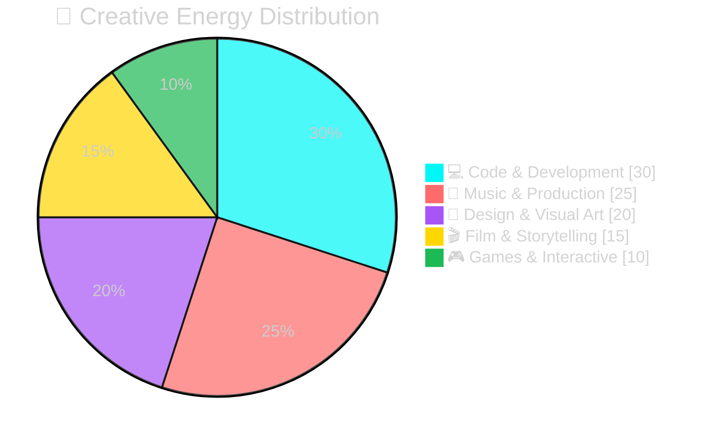

 

&nbsp;&nbsp;&nbsp;&nbsp;&nbsp;&nbsp;&nbsp;&nbsp;&nbsp;&nbsp;&nbsp;&nbsp;&nbsp;&nbsp;

## ✦ WHO AM I ✦

Multi-dimensional creator from **Brazil** 🇧🇷 passionate about **code**, **music** and **art** 
Creating innovative solutions through technology and creativity • Turning concepts into reality

`🎵 Music` · `💻 Tech` · `🎨 Creative` · `🎬 Film` · `🎮 Games` · `🚀 Innovation`

 

## ✦ TECH ARSENAL ✦

**⚡ Frontend & Frameworks** 
&nbsp;&nbsp;&nbsp;&nbsp;

**⚙️ Backend & Runtime** 
&nbsp;&nbsp;&nbsp;&nbsp;

**☁️ Infrastructure & Data** 
&nbsp;&nbsp;&nbsp;&nbsp;

**🎨 Creative & Design** 
&nbsp;&nbsp;&nbsp;

## ✦ EXPERTISE ✦

```mermaid
%%{init: {'theme':'dark','themeVariables':{'pie1':'#00f7f7','pie2':'#ff6b6b','pie3':'#a855f7','pie4':'#ffd700','pie5':'#1DB954'}}}%%
pie showData
title 🧠 Creative Energy Distribution
"💻 Code & Development" : 30
"🎵 Music & Production" : 25
"🎨 Design & Visual Art" : 20
"🎬 Film & Storytelling" : 15
"🎮 Games & Interactive" : 10
```

## ✦ PROJECTS ✦

 

 

 

## ✦ CONNECT ✦

&nbsp;&nbsp;**Open for collaborations and creative projects**&nbsp;&nbsp;

 

 

## ✦ GITHUB STATS ✦

&nbsp;&nbsp;&nbsp;

 

## ✦ CONTRIBUTIONS ✦

 

## ✦ AWARDS ✦

 

&nbsp;&nbsp;<b>Let's create something extraordinary together!</b>&nbsp;&nbsp;

  

