<div align="center">

<!-- HEADER ANIMADO -->


<!-- TYPING ANIMATION -->


---

### 🌎 **Broadcasting from Brazil** 🇧🇷


</div>

---

## 🎭 **WHO AM I?**

<details open>
<summary><b>🎯 Click to explore my multidimensional profile</b></summary>

<div align="center">


```mermaid
mindmap
  root((GENHO AKADION))
    🎵 MUSIC
      Musician
      Musical Artist
      Lyricist
      Music Engineer
      Track Creator
    💻 TECH
      Programmer
      Software Developer
      App Creator
      Tool Builder
      Freelancer
    🎨 CREATIVE
      Designer
      Filmmaker
      Video Editor
      Game Creator
      Writer
    🚀 INNOVATION
      Inventor
      Project Designer
      Enthusiast
      Ex-AI Image Creator
      Ex-Illustrator

</div>
```

**🎸 MUSICAL REALM**
- 🎹 Musician & Musical Artist
- ✍️ Lyricist & Composer
- 🎚️ Music Engineer & Producer
- 🎧 Track & Beat Creator

**💻 TECH UNIVERSE**
- 👨‍💻 Programmer & Developer
- 🛠️ Software/App/Tool Creator
- 🔧 Freelance Solutions Architect
- 📱 Full-Stack Creator

**🎨 CREATIVE COSMOS**
- 🎬 Filmmaker & Screenwriter
- 📚 Writer & eBook Author
- 🎮 Game Developer
- 🎥 Video Editor & Creator
- 🎨 Designer & Visual Artist

**🚀 INNOVATION SPHERE**
- 💡 Inventor & Gadget Designer
- 🔬 Project Architect
- 🌟 Enthusiast & Visionary
- 🖼️ Ex-AI Image Creator
- ✏️ Ex-Illustrator

</details>


---

## 🛠️ **TECH ARSENAL**

<div align="center">


### **Core Technologies**


### **Extended Stack**


</div>

---

## 🚀 **LEGENDARY PROJECTS**

<div align="center">


</div>

<details>
<summary><b>🔥 Akia.js - Universal Renderer</b></summary>

```javascript
// Singleton renderer transpiling 7+ languages
const akiaEngine = {
  languages: ['JavaScript', 'TypeScript', 'ESNext', 'CoffeeScript', 'Dart', 'Kotlin', 'Swift'],
  power: 'MAXIMUM',
  innovation: '∞'
};
```

**Tech:** `JavaScript` `ESNext` `Transpiler` `Compiler`


</details>

<details>
<summary><b>⚡ .ak Language - Proprietary Web Language</b></summary>

```ak
// The future of web development
.ak => {
  compiler: "native",
  purpose: "modern web revolution",
  status: "legendary"
}
```

**Tech:** `Compiler Design` `Native Language` `Web Innovation`


</details>

<details>
<summary><b>🌐 readgex - Intelligent AI Browser</b></summary>

<div align="center">


</div>

**Tech:** `React` `TypeScript` `AI` `Autonomous Agent`


</details>

<details>
<summary><b>🎵 IUKKA Player - Quantum Streaming</b></summary>

**Tech:** `WebRTC` `Media APIs` `Quantum Processing`


</details>

<details>
<summary><b>💼 SHIYO - Social Media Portfolio Platform</b></summary>

**Tech:** `React` `Node.js` `Social Integration`


</details>

<details>
<summary><b>🎨 NYX - Creative Portfolio Showcase</b></summary>

**Tech:** `React` `WebGL` `3D Graphics`


</details>

<details>
<summary><b>🏢 Akadaion - Institutional HQ</b></summary>

**Tech:** `Next.js` `TypeScript` `Enterprise`


</details>

<details>
<summary><b>🧠 Bilbid - Semantic Knowledge Engine</b></summary>

**Tech:** `AI` `NLP` `Wikipedia API` `Knowledge Graph`


</details>

<details>
<summary><b>📊 dashka - Universal Dashboard</b></summary>

**Tech:** `Dashboard` `Admin Panel` `Site Management`


</details>

<details>
<summary><b>✨ Fillshy - Background AI Content Generator</b></summary>

**Tech:** `AI` `Content Generation` `Background Processing`


</details>

<details>
<summary><b>🎯 Owni - Component & Icon Library</b></summary>

**Tech:** `SVG` `Animated Icons` `Web Components` `Multi-Language`


</details>

---

## 📊 **CREATOR STATS**

<div align="center">


### **GitHub Activity**


</div>

---

## 🌐 **CONNECT WITH ME**

<div align="center">


### **🎵 Music & Audio Platforms**

[](https://soundcloud.com/iakadion)
[](https://open.spotify.com/user/31w3syplutlik764wir6lrl4zlum)
[](https://beatstars.com/akadion)
[](https://soundverse.com/akadion)
[](https://suno.com/akadion)
[](https://genius.com/akadion)

### **📱 Social Media**

[](https://instagram.com/iakadion)
[](https://youtube.com/@iakadion)
[](https://twitter.com/iakadion)
[](https://twitch.tv/iakadion)
[](https://m.facebook.com/profile.php?id=100075107335354)
[](https://threads.net/@iakadion)
[](https://bsky.app/profile/akadion)
[](https://mastodon.social/@akadion)
[](https://reddit.com/u/iakadion)
[](https://tumblr.com/akadion)
[](https://gettr.com/akadion)

### **💻 Developer Platforms**

[](https://github.com/iakadion)
[](https://gitlab.com/akadion)
[](https://codepen.io/akadion)
[](https://stackoverflow.com/users/akadion)
[](https://replit.com/@akadion)
[](https://codesandbox.io/akadion)
[](https://npmjs.com/~akadion)
[](https://hub.docker.com/u/akadion)

### **🎨 Design & Creative**

[](https://behance.net/akadion)
[](https://dribbble.com/akadion)
[](https://figma.com/@akadion)
[](https://vimeo.com/akadion)
[](https://layers.io/akadion)

### **✍️ Writing & Content**

[](https://medium.com/@akadion)
[](https://wordpress.com/iakadion)
[](https://wattpad.com/user/iakadion)
[](https://hashnode.com/@akadion)
[](https://quora.com/profile/akadion)

### **🎮 Gaming & Streaming**

[](https://steamcommunity.com/id/iakadion)
[](https://kick.com/akadion)
[](https://fandom.com/u/iakadion)

### **🚀 Tech & Innovation**

[](https://producthunt.com/@akadion)
[](https://patreon.com/akadion)
[](https://lovable.dev/akadion)
[](https://producer.ai/akadion)
[](https://whoop.com/akadion)

### **📧 Direct Contact**

[](mailto:ogenhoanimation01@gmail.com)

</div>

---

## 🎯 **SKILLS VISUALIZATION**

```mermaid
%%{init: {'theme':'dark'}}%%
graph TD
    A[GENHO AKADION] --> B[💻 DEVELOPMENT]
    A --> C[🎵 MUSIC]
    A --> D[🎨 DESIGN]
    A --> E[✍️ CONTENT]
    
    B --> B1[React/Next.js]
    B --> B2[TypeScript]
    B --> B3[AI/ML]
    
    C --> C1[Production]
    C --> C2[Composition]
    C --> C3[Engineering]
    
    D --> D1[UI/UX]
    D --> D2[3D/WebGL]
    D --> D3[Video]
    
    E --> E1[Screenwriting]
    E --> E2[Books/eBooks]
    E --> E3[Lyrics]
    
    style A fill:#00f7f7,stroke:#00a8a8,color:#000
    style B fill:#ff6b6b,stroke:#cc5555
    style C fill:#4ecdc4,stroke:#3ea39d
    style D fill:#f7b731,stroke:#c69227
    style E fill:#a29bfe,stroke:#7d75cc
```

<div align="center">



</div>

---

## 🔥 **WORKFLOW**

<div align="center">


</div>

---

## 💡 **INNOVATION METRICS**

<div align="center">


</div>

---

## 🌟 **PHILOSOPHY**

<div align="center">


### *"Create. Innovate. Inspire. Repeat."*

```typescript
class Creator {
  readonly passion = Infinity;
  readonly innovation = "∞";
  readonly determination = true;
  
  async create(): Promise<Masterpiece> {
    while(this.passion > 0) {
      await this.innovate();
      await this.inspire();
      await this.learn();
    }
    return new Masterpiece();
  }
}

const genho = new Creator();
genho.create(); // Never stops
```

</div>

---

## 📈 **CONTRIBUTION GRAPH**

<div align="center">


</div>

---

## 🎪 **FUN FACTS**

<details>
<summary><b>🎲 Click for easter eggs!</b></summary>

<div align="center">


- 🌎 Based in the vibrant **Brazil** 🇧🇷
- 🎵 Can create a full track while debugging code
- 🎬 Dreams in cinematic sequences
- 💻 Writes code like poetry
- 🎨 Designs with emotion
- ⚡ Powered by coffee and creativity
- 🚀 Believes in the impossible
- 🎯 Multi-dimensional thinking is my superpower

```
  _______ _    _ ______ _   _ _  __ _____  
 |__   __| |  | |  ____| \ | | |/ // ____|
    | |  | |__| | |__  |  \| | ' /| (___  
    | |  |  __  |  __| | . ` |  <  \___ \ 
    | |  | |  | | |____| |\  | . \ ____) |
    |_|  |_|  |_|______|_| \_|_|\_\_____/ 
```

</div>

</details>

---

## 🏆 **ACHIEVEMENTS**

<div align="center">

[](https://github.com/ryo-ma/github-profile-trophy)

</div>

---

## 🎬 **LATEST ACTIVITY**

<div align="center">

<!--START_SECTION:activity-->
<!--END_SECTION:activity-->

</div>

---

## 💖 **SUPPORT MY WORK**

<div align="center">


If you love what I create, consider supporting me!

[](https://patreon.com/akadion)
[](mailto:ogenhoanimation01@gmail.com)

</div>

---

## 📊 **VISITOR ANALYTICS**

<div align="center">


[](https://github.com/iakadion)

</div>

---

<div align="center">

### 🌟 **"The future belongs to those who create it"** 🌟


---

**⚡ Built with passion, powered by creativity ⚡**

**🚀 Let's create the future together! 🚀**

</div>
```

