<div align="center">


<a href="https://genhoakadion.dev">

</a>

<div>


</div>

✦ ━━━━━━━━━━━━━━━━━━━━━━━ 🤖 ━━━━━━━━━━━━━━━━━━━━━━━ ✦

```mermaid
mindmap
  root((GENHO<br/>AKADION))
    (🎵 SONIC LAB)
      [Audio Engineer]
      [Beat Architect]
      [Lyricist]
    (💻 KERNEL)
      [Full-Stack Node]
      [Language Author]
      [AI Systems]
    (🎨 VISION)
      [Cinematographer]
      [UX UI Sculptor]
      [3D World Builder]
    (🚀 BEYOND)
      [Invention]
      [Philosophy]
      [Quantum Thought]
```

<h2> ⌘ IDENTITY MATRIX ⌘ </h2>




✦ ━━━━━━━━━━━━━━━━━━━━━━━ 🌐 ━━━━━━━━━━━━━━━━━━━━━━━ ✦

<h2> ⌘ APP DIRECTORY / CONNECT ⌘ </h2>

<h3> 🎧 FREQUENCY WAVES 🎧 </h3>
<a href="https://soundcloud.com/iakadion"></a>
<a href="https://open.spotify.com/user/31w3syplutlik764wir6lrl4zlum"></a>
<a href="https://beatstars.com/akadion"></a>
<a href="https://soundverse.com/akadion"></a>
<a href="https://suno.com/akadion"></a>
<a href="https://genius.com/akadion"></a>

<h3> 📱 SOCIAL PROTOCOLS 📱 </h3>
<a href="https://instagram.com/iakadion"></a>
<a href="https://youtube.com/@iakadion"></a>
<a href="https://twitter.com/iakadion"></a>
<a href="https://twitch.tv/iakadion"></a>
<a href="https://threads.net/@iakadion"></a>
<a href="https://bsky.app/profile/akadion"></a>
<a href="https://reddit.com/u/iakadion"></a>

<h3> 💻 TERMINAL ACCESS 💻 </h3>
<a href="https://github.com/iakadion"></a>
<a href="https://gitlab.com/akadion"></a>
<a href="https://codepen.io/akadion"></a>
<a href="https://stackoverflow.com/users/akadion"></a>
<a href="https://replit.com/@akadion"></a>
<a href="https://hub.docker.com/u/akadion"></a>

<h3> 🎨 CANVAS INTERFACES 🎨 </h3>
<a href="https://behance.net/akadion"></a>
<a href="https://dribbble.com/akadion"></a>
<a href="https://figma.com/@akadion"></a>
<a href="https://medium.com/@akadion"></a>

✦ ━━━━━━━━━━━━━━━━━━━━━━━ 🧠 ━━━━━━━━━━━━━━━━━━━━━━━ ✦

<h2> ⌘ TECH ARSENAL ⌘ </h2>


<a href="https://skillicons.dev">

</a>

<a href="https://skillicons.dev">

</a>

✦ ━━━━━━━━━━━━━━━━━━━━━━━ 🚀 ━━━━━━━━━━━━━━━━━━━━━━━ ✦

<h2> ⌘ LEGENDARY PROGRAMS ⌘ </h2>


<details open>
<summary><b>🔥 ［ Akia.js ］ UNIVERSAL RENDERER</b></summary>
<div></div>
<div>  </div>
<div></div>
</details>

<details open>
<summary><b>⚡ ［ .ak ］ PROPRIETARY WEB LANGUAGE</b></summary>
<div></div>
<div> </div>
<div></div>
</details>

<details>
<summary><b>🌐 ［ Readgex ］ AUTONOMOUS BRWSR AGENT</b></summary>
<div></div>
<div> </div>
<div></div>
</details>

<details>
<summary><b>🧠 ［ Bilbid ］ SEMANTIC KNOWLEDGE ENGINE</b></summary>
<div> </div>
</details>

<details>
<summary><b>🎵 ［ IUKKA ］ QUANTUM MEDIA STREAMING</b></summary>
<div> </div>
</details>

<details>
<summary><b>💼 ［ SHIYO ］ SOCIAL PORTFOLIO PROTOCOL</b></summary>
<div> </div>
</details>

<details>
<summary><b>🎨 ［ NYX ］ 3D VISUAL SHOWCASE ENV</b></summary>
<div> </div>
</details>

<details>
<summary><b>🏢 ［ Akadaion ］ ENTERPRISE HQ DB</b></summary>
<div> </div>
</details>

✦ ━━━━━━━━━━━━━━━━━━━━━━━ 📊 ━━━━━━━━━━━━━━━━━━━━━━━ ✦

<h2> ⌘ ANALYTICS & DIAGNOSTICS ⌘ </h2>


<div>


</div>

<div>

</div>

<div>

</div>

✦ ━━━━━━━━━━━━━━━━━━━━━━━ 🧬 ━━━━━━━━━━━━━━━━━━━━━━━ ✦

```mermaid
%%{init: {'theme': 'base', 'themeVariables': { 'primaryColor': '#0a0c10', 'edgeLabelBackground':'#12141a', 'tertiaryColor': '#12141a', 'primaryBorderColor': '#00f7f7', 'lineColor': '#ff0055'}}}%%
graph TD
    A(("🔥 INSPIRATION")) --> B{"💡 CONCEPT"}
    B -->|CODE| C["[ TERMINAL ]"]
    B -->|AUDIO| D["[ STUDIO ]"]
    B -->|VISUAL| E["[ CANVAS ]"]
    C --> F{"🛠 SYNTHESIS"}
    D --> F
    E --> F
    F -->|COMPILE| G(("✅ MASTERPIECE"))
    G -.->|FEEDBACK LOOP| A
```

<h2> ⌘ NEURAL WORKFLOW ⌘ </h2>



```typescript
// CORE ENGINE: INFINITE CREATION LOOP
class GenhoEntity extends Creator implements MultiDimensional {
  public energyLevel: number = Infinity;
  public focus: string[] = ['Code', 'Audio', 'Visuals'];

  async executeLifeCycle(): Promise<void> {
    while (this.energyLevel > 0) {
      const abstractIdea = await this.observeUniverse();
      const mappedData = this.translateToVisions(abstractIdea);
      
      await Promise.all([
        this.writeCode(mappedData),
        this.produceBPM(mappedData),
        this.renderPixels(mappedData)
      ]);

      await this.inspireCollective();
      this.evolveVersion();
    }
  }
}

new GenhoEntity().executeLifeCycle();
```

✦ ━━━━━━━━━━━━━━━━━━━━━━━ 🐍 ━━━━━━━━━━━━━━━━━━━━━━━ ✦

<h2> ⌘ COMMIT ACTIVITY GRID ⌘ </h2>

<picture>
  <source media="(prefers-color-scheme: dark)" srcset="https://raw.githubusercontent.com/iakadion/iakadion/output/github-contribution-grid-snake-dark.svg">
  <source media="(prefers-color-scheme: light)" srcset="https://raw.githubusercontent.com/iakadion/iakadion/output/github-contribution-grid-snake.svg">
  
</picture>

✦ ━━━━━━━━━━━━━━━━━━━━━━━ 🏆 ━━━━━━━━━━━━━━━━━━━━━━━ ✦

<h2> ⌘ UNLOCKED ACHIEVEMENTS ⌘ </h2>

<a href="https://github.com/ryo-ma/github-profile-trophy">

</a>

<div>


</div>


</div>
