<div align="center">

<!-- ═══════════════════════════════════════════════════════════════ -->
<!-- HEADER -->
<!-- ═══════════════════════════════════════════════════════════════ -->


<!-- TYPING ANIMATION -->
<a href="https://git.io/typing-svg">
  
</a>

<br/>

<!-- LOCATION & STATUS -->

&nbsp;

&nbsp;


<br/><br/>

<!-- ANIMATED DIVIDER -->


</div>

<!-- ═══════════════════════════════════════════════════════════════ -->
<!-- ABOUT ME SECTION -->
<!-- ═══════════════════════════════════════════════════════════════ -->

<br/>

<div align="center">
  
  <h2>
    
    &nbsp; THE ARCHITECT &nbsp;
    
  </h2>
  
</div>

<br/>

<table align="center">
<tr>
<td width="50%" valign="top">

<div align="center">


<br/><br/>

```yaml
name: "Genho Akadion"
title: "Multi-Dimensional Creator"
location: "Brazil 🇧🇷"
current_mission: "Building the Future"

philosophy:
  - "Create what doesn't exist"
  - "Break barriers between disciplines"
  - "Art is Technology, Technology is Art"
```

</div>

</td>
<td width="50%" valign="top">

<div align="center">

### 🌌 **Dimensions I Operate In**

</div>

<br/>

| Dimension | Role | Mastery |
|:-:|:-:|:-:|
| 🎵 **Sound** | Musician · Producer · Engineer | `████████████░░` 85% |
| 💻 **Code** | Full-Stack Dev · Tool Builder | `██████████████░` 93% |
| 🎬 **Visual** | Filmmaker · Designer · VFX | `███████████░░░░` 78% |
| ✍️ **Words** | Writer · Lyricist · Storyteller | `████████████░░░` 82% |
| 🎮 **Gaming** | Game Dev · World Builder | `██████████░░░░░` 70% |
| 🚀 **Innovation** | Inventor · Architect · Visionary | `█████████████░░` 90% |

<br/>

<div align="center">

> *"I don't choose between code and music —*
> *I compose symphonies in both."*

</div>

</td>
</tr>
</table>

<br/>

<div align="center">

</div>

<!-- ═══════════════════════════════════════════════════════════════ -->
<!-- CONNECT SECTION -->
<!-- ═══════════════════════════════════════════════════════════════ -->

<br/>

<div align="center">
  <h2>
    
    &nbsp; FREQUENCY CHANNELS &nbsp;
    
  </h2>
</div>

<br/>

<div align="center">

<!-- 🎵 SOUND & FREQUENCY -->
<details open>
<summary><b>&nbsp;🎵 SOUND & FREQUENCY&nbsp;</b></summary>
<br/>
<a href="https://soundcloud.com/iakadion"></a>
<a href="https://open.spotify.com/user/31w3syplutlik764wir6lrl4zlum"></a>
<a href="https://beatstars.com/akadion"></a>
<a href="https://soundverse.com/akadion"></a>
<a href="https://suno.com/akadion"></a>
<a href="https://genius.com/akadion"></a>
<br/><br/>
</details>

<!-- 📱 SOCIAL & MEDIA -->
<details open>
<summary><b>&nbsp;📱 SOCIAL & MEDIA&nbsp;</b></summary>
<br/>
<a href="https://instagram.com/iakadion"></a>
<a href="https://youtube.com/@iakadion"></a>
<a href="https://twitter.com/iakadion"></a>
<a href="https://twitch.tv/iakadion"></a>
<a href="https://m.facebook.com/profile.php?id=100075107335354"></a>
<a href="https://threads.net/@iakadion"></a>
<a href="https://bsky.app/profile/akadion"></a>
<a href="https://reddit.com/u/iakadion"></a>
<br/><br/>
</details>

<!-- 💻 CODE & DEV -->
<details open>
<summary><b>&nbsp;💻 CODE & DEV&nbsp;</b></summary>
<br/>
<a href="https://github.com/iakadion"></a>
<a href="https://gitlab.com/akadion"></a>
<a href="https://codepen.io/akadion"></a>
<a href="https://stackoverflow.com/users/akadion"></a>
<a href="https://replit.com/@akadion"></a>
<a href="https://hub.docker.com/u/akadion"></a>
<br/><br/>
</details>

<!-- 🎨 CREATIVE STUDIO -->
<details open>
<summary><b>&nbsp;🎨 CREATIVE STUDIO&nbsp;</b></summary>
<br/>
<a href="https://behance.net/akadion"></a>
<a href="https://dribbble.com/akadion"></a>
<a href="https://figma.com/@akadion"></a>
<a href="https://medium.com/@akadion"></a>
<a href="https://wordpress.com/iakadion"></a>
<br/><br/>
</details>

<!-- 🚀 SUPPORT & CONTACT -->
<details open>
<summary><b>&nbsp;🚀 SUPPORT & CONTACT&nbsp;</b></summary>
<br/>
<a href="https://producthunt.com/@akadion"></a>
<a href="https://patreon.com/akadion"></a>
<a href="mailto:ogenhoanimation01@gmail.com"></a>
<br/><br/>
</details>

</div>

<br/>

<div align="center">

</div>

<!-- ═══════════════════════════════════════════════════════════════ -->
<!-- TECH ARSENAL -->
<!-- ═══════════════════════════════════════════════════════════════ -->

<br/>

<div align="center">
  <h2>
    
    &nbsp; TECH ARSENAL &nbsp;
    
  </h2>
</div>

<br/>

<div align="center">

<!-- LANGUAGES -->
<h4>⚡ Languages & Core</h4>


<br/><br/>

<!-- FRONTEND -->
<h4>🎨 Frontend & UI</h4>


<br/><br/>

<!-- BACKEND & DATA -->
<h4>⚙️ Backend & Data</h4>


<br/><br/>

<!-- DEVOPS & TOOLS -->
<h4>🛠️ DevOps & Tools</h4>


<br/><br/>

<!-- CREATIVE & 3D -->
<h4>🎬 Creative & Design</h4>


<br/><br/>

<!-- BUILD TOOLS -->
<h4>📦 Build & Runtime</h4>


</div>

<br/>

<div align="center">

</div>

<!-- ═══════════════════════════════════════════════════════════════ -->
<!-- LEGENDARY PROJECTS -->
<!-- ═══════════════════════════════════════════════════════════════ -->

<br/>

<div align="center">
  <h2>
    
    &nbsp; LEGENDARY PROJECTS &nbsp;
    
  </h2>

  <br/>

  <i>"Each project is a universe I architect from zero."</i>
</div>

<br/>

<!-- ROW 1 -->
<table align="center">
<tr>

<td width="50%">
<div align="center">
<h3>🔥 Akia.js</h3>
<sub><b>Universal Renderer Engine</b></sub>
<br/><br/>


<br/><br/>

```
 Singleton renderer transpiling 7+
 languages with Native Innovation.
```


<br/>
<sub>▓▓▓▓▓▓▓▓▓▓▓▓▓▓▓▓▓▓▓░ 95%</sub>
</div>
</td>

<td width="50%">
<div align="center">
<h3>⚡ .ak Language</h3>
<sub><b>Proprietary Web Language</b></sub>
<br/><br/>


<br/><br/>

```
 The future of web development.
 Native compiler for modern revolution.
```


<br/>
<sub>▓▓▓▓▓▓▓▓▓▓▓▓▓▓▓▓▓░░░ 88%</sub>
</div>
</td>

</tr>
</table>

<!-- ROW 2 -->
<table align="center">
<tr>

<td width="50%">
<div align="center">
<h3>🌐 Readgex</h3>
<sub><b>Intelligent AI Browser</b></sub>
<br/><br/>


<br/><br/>

```
 Smart Autonomous Agent Browser
 with AI Integration.
```


<br/>
<sub>▓▓▓▓▓▓▓▓▓▓▓▓▓▓▓▓░░░░ 82%</sub>
</div>
</td>

<td width="50%">
<div align="center">
<h3>🧠 Bilbid</h3>
<sub><b>Semantic Knowledge Engine</b></sub>
<br/><br/>


<br/><br/>

```
 Semantic knowledge graph with
 NLP-powered intelligence.
```


<br/>
<sub>▓▓▓▓▓▓▓▓▓▓▓▓▓▓▓▓▓░░░ 87%</sub>
</div>
</td>

</tr>
</table>

<br/>

<!-- MORE PROJECTS - COMPACT GRID -->
<div align="center">
<h4>🗂️ More From the Lab</h4>
</div>

<table align="center">
<tr>
<td align="center" width="16.6%">
<br/>
<b>🎵 IUKKA</b><br/>
<sub>Quantum Streaming<br/>Player</sub><br/><br/>

<br/><br/>
</td>
<td align="center" width="16.6%">
<br/>
<b>💼 SHIYO</b><br/>
<sub>Social Portfolio<br/>Platform</sub><br/><br/>

<br/><br/>
</td>
<td align="center" width="16.6%">
<br/>
<b>🎨 NYX</b><br/>
<sub>Creative Portfolio<br/>Showcase</sub><br/><br/>

<br/><br/>
</td>
<td align="center" width="16.6%">
<br/>
<b>🏢 AKADAION</b><br/>
<sub>Institutional<br/>HQ</sub><br/><br/>

<br/><br/>
</td>
<td align="center" width="16.6%">
<br/>
<b>📊 AKASH</b><br/>
<sub>Universal<br/>Dashboard</sub><br/><br/>

<br/><br/>
</td>
<td align="center" width="16.6%">
<br/>
<b>✨ FILLSHY</b><br/>
<sub>AI Content<br/>Generator</sub><br/><br/>

<br/><br/>
</td>
</tr>
<tr>
<td align="center" colspan="6">
<br/>
<b>🎯 OWNI</b> — Component & Animated Icon Library &nbsp;&nbsp;|&nbsp;&nbsp; <i>...and many more in the forge</i>
<br/><br/>
</td>
</tr>
</table>

<br/>

<div align="center">

</div>

<!-- ═══════════════════════════════════════════════════════════════ -->
<!-- GITHUB STATS -->
<!-- ═══════════════════════════════════════════════════════════════ -->

<br/>

<div align="center">
  <h2>
    
    &nbsp; PERFORMANCE METRICS &nbsp;
    
  </h2>
</div>

<br/>

<div align="center">

<!-- STATS ROW 1 -->
<a href="https://github.com/iakadion">
  
</a>
&nbsp;&nbsp;
<a href="https://github.com/iakadion">
  
</a>

<br/><br/>

<!-- STREAK -->
<a href="https://github.com/iakadion">
  
</a>

<br/><br/>

<!-- ACTIVITY GRAPH -->
<a href="https://github.com/iakadion">
  
</a>

</div>

<br/>

<div align="center">

</div>

<!-- ═══════════════════════════════════════════════════════════════ -->
<!-- WORKFLOW & PHILOSOPHY -->
<!-- ═══════════════════════════════════════════════════════════════ -->

<br/>

<div align="center">
  <h2>
    
    &nbsp; WORKFLOW & PHILOSOPHY &nbsp;
    
  </h2>
</div>

<br/>

<div align="center">



<br/>

```mermaid
%%{init: {'theme':'dark', 'themeVariables': {'primaryColor': '#00f7f7', 'primaryTextColor': '#fff', 'primaryBorderColor': '#6c5ce7', 'lineColor': '#ff6b6b', 'secondaryColor': '#0d1117', 'tertiaryColor': '#161b22'}}}%%
graph LR
    A["💡 Inspiration"] -->|"Spark"| B("🔨 Creation")
    B -->|"Code / Music / Art"| C{"🧪 Innovation"}
    C -->|"Refine"| D["✨ Masterpiece"]
    C -->|"Iterate"| A
    D -->|"Share"| E["🌍 Impact"]
    E -->|"Feedback"| A

    style A fill:#6c5ce7,stroke:#6c5ce7,stroke-width:2px,color:#fff
    style B fill:#00f7f7,stroke:#00f7f7,stroke-width:2px,color:#000
    style C fill:#ff6b6b,stroke:#ff6b6b,stroke-width:2px,color:#fff
    style D fill:#ffd93d,stroke:#ffd93d,stroke-width:2px,color:#000
    style E fill:#6c5ce7,stroke:#6c5ce7,stroke-width:2px,color:#fff
```

```typescript
// ─── The Infinite Loop of Creation ───────────────────────

class GenhoAkadion implements Creator, Musician, Developer, Artist {
  
  readonly name    = "Genho Akadion";
  readonly mission = "Build what doesn't exist yet";
  readonly fuel    = Infinity;

  async live(): Promise<void> {
    while (this.isAlive()) {
      const idea    = await this.imagine();
      const project = await this.build(idea);
      const art     = await this.polish(project);
      
      await this.shareWithWorld(art);
      await this.learnFromFeedback();
      // The loop never breaks ♾️
    }
  }
}

new GenhoAkadion().live();
```

<br/>

### ✦ *"Create. Innovate. Inspire. Repeat."* ✦

</div>

<br/>

<div align="center">

</div>

<!-- ═══════════════════════════════════════════════════════════════ -->
<!-- CONTRIBUTIONS SNAKE -->
<!-- ═══════════════════════════════════════════════════════════════ -->

<br/>

<div align="center">
  <h2>
    🐍 &nbsp; CONTRIBUTION SNAKE &nbsp; 🐍
  </h2>
  <br/>
  
</div>

<br/>

<div align="center">

</div>

<!-- ═══════════════════════════════════════════════════════════════ -->
<!-- ACHIEVEMENTS & FOOTER -->
<!-- ═══════════════════════════════════════════════════════════════ -->

<br/>

<div align="center">
  <h2>🏆 &nbsp; TROPHY CASE &nbsp; 🏆</h2>
  <br/>
  <a href="https://github.com/ryo-ma/github-profile-trophy">
    
  </a>
</div>

<br/><br/>

<!-- METRICS BAR -->
<div align="center">
  
  &nbsp;
  
  &nbsp;
  
  &nbsp;
  
</div>

<br/><br/>

<!-- SPOTIFY NOW PLAYING (optional) -->
<div align="center">
  
</div>

<br/>

<!-- FOOTER WAVE -->
<div align="center">


<br/>


<br/>

<sub>
  <b>© 2026 Genho Akadion</b> — <i>All dimensions reserved.</i>
</sub>

</div>
