<div align="center">

<!-- HEADER: WAVE + TYPING -->


<a href="https://git.io/typing-svg">
  
</a>

<br/>

<!-- LOCATION BADGE -->
 <b>Broadcasting from Brazil</b> 🇧🇷 

</div>

---

## 🎭 **WHO AM I?**

```mermaid
mindmap
  root((GENHO AKADION))
    🎵 MUSIC
      Musician / Lyricist
      Music Engineer
    💻 TECH
      Full-Stack Dev
      Tool Builder
    🎨 CREATIVE
      Filmmaker
      Designer
    🚀 INNOVATION
      Inventor
      Visionary
```

<div align="center">



<br>

> *I am a multi-dimensional creator navigating the intersection of Code, Music, and Visual Arts.*
>
> 🎸 **Music:** Musician, Artist, Lyricist, Engineer & Producer
> 💻 **Tech:** Programmer, Software Developer, Full-Stack Creator
> 🎨 **Creative:** Filmmaker, Writer, Game Dev, Visual Artist
> 🚀 **Innovation:** Inventor, Architect, Visionary & Enthusiast

</div>

---

## 📡 **CONNECT WITH ME**

<div align="center">

<!-- MUSIC & AUDIO -->
<p>
<b>🎵 SOUND & FREQUENCY</b><br>
<a href="https://soundcloud.com/iakadion"></a>
<a href="https://open.spotify.com/user/31w3syplutlik764wir6lrl4zlum"></a>
<a href="https://beatstars.com/akadion"></a>
<a href="https://soundverse.com/akadion"></a>
<a href="https://suno.com/akadion"></a>
<a href="https://genius.com/akadion"></a>
</p>

<!-- SOCIAL media -->
<p>
<b>📱 SOCIAL & MEDIA</b><br>
<a href="https://instagram.com/iakadion"></a>
<a href="https://youtube.com/@iakadion"></a>
<a href="https://twitter.com/iakadion"></a>
<a href="https://twitch.tv/iakadion"></a>
<a href="https://m.facebook.com/profile.php?id=100075107335354"></a>
<a href="https://threads.net/@iakadion"></a>
<a href="https://bsky.app/profile/akadion"></a>
<a href="https://reddit.com/u/iakadion"></a>
</p>

<!-- DEVELOPER -->
<p>
<b>💻 CODE & DEV</b><br>
<a href="https://github.com/iakadion"></a>
<a href="https://gitlab.com/akadion"></a>
<a href="https://codepen.io/akadion"></a>
<a href="https://stackoverflow.com/users/akadion"></a>
<a href="https://replit.com/@akadion"></a>
<a href="https://hub.docker.com/u/akadion"></a>
</p>

<!-- CREATIVE & CONTENT -->
<p>
<b>🎨 CREATIVE & WRITING</b><br>
<a href="https://behance.net/akadion"></a>
<a href="https://dribbble.com/akadion"></a>
<a href="https://figma.com/@akadion"></a>
<a href="https://medium.com/@akadion"></a>
<a href="https://wordpress.com/iakadion"></a>
</p>

<!-- DIRECT & SUPPORT -->
<p>
<b>🚀 INNOVATION & SUPPORT</b><br>
<a href="https://producthunt.com/@akadion"></a>
<a href="https://patreon.com/akadion"></a>
<a href="mailto:ogenhoanimation01@gmail.com"></a>
</p>

</div>

---

## 🛠️ **TECH ARSENAL**

<div align="center">


<br><br>


<br>


</div>

---

## 🚀 **LEGENDARY PROJECTS**

<div align="center">

</div>
<br>

<details open>
<summary><b>🔥 Akia.js - Universal Renderer</b> (Click to collapse)</summary>

> *Singleton renderer transpiling 7+ languages with Native Innovation.*
> **Tech:** `JavaScript` `ESNext` `Transpiler` `Compiler`
> 
</details>

<details>
<summary><b>⚡ .ak Language - Proprietary Web Language</b></summary>

> *The future of web development. Native compiler for modern revolution.*
> **Tech:** `Compiler Design` `Native Language` `Web Innovation`
> 
</details>

<details>
<summary><b>🌐 readgex - Intelligent AI Browser</b></summary>

> *Smart Autonomous Agent Browser Integration.*
> **Tech:** `React` `TypeScript` `AI` `Autonomous Agent`
> 
</details>

<details>
<summary><b>🧠 Bilbid - Semantic Knowledge Engine</b></summary>

> **Tech:** `AI` `NLP` `Wikipedia API` `Knowledge Graph`
> 
</details>

<details>
<summary><b>🎵 IUKKA Player - Quantum Streaming</b></summary>
<b>Tech:</b> `WebRTC` `Media APIs` `Quantum Processing`
</details>

<details>
<summary><b>💼 SHIYO - Social Media Portfolio Platform</b></summary>
<b>Tech:</b> `React` `Node.js` `Social Integration`
</details>

<details>
<summary><b>🎨 NYX - Creative Portfolio Showcase</b></summary>
<b>Tech:</b> `React` `WebGL` `3D Graphics`
</details>

<details>
<summary><b>🏢 Akadaion - Institutional HQ</b></summary>
<b>Tech:</b> `Next.js` `TypeScript` `Enterprise`
</details>

<details>
<summary><b>📊 akash - Universal Dashboard</b></summary>
<b>Tech:</b> `Dashboard` `Admin Panel` `Site Management`
</details>

<details>
<summary><b>✨ Fillshy - Background AI Content Generator</b></summary>
<b>Tech:</b> `AI` `Content Generation` `Background Processing`
</details>

<details>
<summary><b>🎯 Owni - Component & Icon Library</b></summary>
<b>Tech:</b> `Owm` `Animated Icons` `Web Components`
</details>

---

## 📊 **CREATOR STATS**

<div align="center">


<br>


<br>


<br>


</div>

---

## 🧠 **WORKFLOW & PHILOSOPHY**

<div align="center">


### *"Create. Innovate. Inspire. Repeat."*

```typescript
// The Infinite Loop of Creation
const genho = new Creator();
while(genho.isAlive) {
  await genho.innovate();
  await genho.inspire();
}
```

</div>

---

## 🐍 **CONTRIBUTIONS**

<div align="center">

</div>

---

<div align="center">

### 🏆 **ACHIEVEMENTS**

[](https://github.com/ryo-ma/github-profile-trophy)

<br/>

 • [](https://github.com/iakadion)

<br/>

<!-- FOOTER -->


**⚡ Built with passion, powered by creativity ⚡**

</div>
