```mermaid
mindmap
  root((GENHO AKADION))
    MUSIC
      Musician / Lyricist
      Engineer / Producer
      Sound Experiments
    TECH
      Full‑Stack Development
      Tooling & Automation
      Systems / Architecture
    VISUAL
      Filmmaking
      Design Direction
      Motion / Interactive
    INNOVATION
      Inventor Mindset
      Prototyping
      Future‑Driven R&D
```

<!-- =========================================
     2026 • PRO MAX • MODERN README (NO TABLES)
     Paste this into your README.md
========================================== -->

<div align="center">

  <!-- HERO / HEADER -->
  

  <!-- TYPING / TAGLINE -->
  <a href="https://git.io/typing-svg">
    
  </a>

  <br/><br/>

  <!-- MICRO BADGES -->
  
  

  <br/><br/>

  <!-- QUICK NAV -->
  <p>
    <a href="#about">About</a> •
    <a href="#connect">Connect</a> •
    <a href="#stack">Stack</a> •
    <a href="#projects">Projects</a> •
    <a href="#stats">Stats</a> •
    <a href="#workflow">Workflow</a>
  </p>

  

</div>

---

<h2 id="about">🧬 About</h2>

<div align="center">

  

  <br/><br/>

  <blockquote>
    I build at the intersection of <b>software</b>, <b>sound</b>, and <b>visual storytelling</b> — turning ideas into systems, experiences, and worlds.
  </blockquote>

</div>



---

<h2 id="connect">📡 Connect</h2>

<div align="center">

  

  <br/>

  <p><b>🎵 SOUND & FREQUENCY</b></p>
  <p>
    <a href="https://soundcloud.com/iakadion"></a>
    <a href="https://open.spotify.com/user/31w3syplutlik764wir6lrl4zlum"></a>
    <a href="https://beatstars.com/akadion"></a>
    <a href="https://soundverse.com/akadion"></a>
    <a href="https://suno.com/akadion"></a>
    <a href="https://genius.com/akadion"></a>
  </p>

  <br/>

  <p><b>📱 SOCIAL & MEDIA</b></p>
  <p>
    <a href="https://instagram.com/iakadion"></a>
    <a href="https://youtube.com/@iakadion"></a>
    <a href="https://twitter.com/iakadion"></a>
    <a href="https://twitch.tv/iakadion"></a>
    <a href="https://threads.net/@iakadion"></a>
    <a href="https://bsky.app/profile/akadion"></a>
    <a href="https://reddit.com/u/iakadion"></a>
    <a href="https://m.facebook.com/profile.php?id=100075107335354"></a>
  </p>

  <br/>

  <p><b>💻 CODE & DEV</b></p>
  <p>
    <a href="https://github.com/iakadion"></a>
    <a href="https://gitlab.com/akadion"></a>
    <a href="https://codepen.io/akadion"></a>
    <a href="https://stackoverflow.com/users/akadion"></a>
    <a href="https://replit.com/@akadion"></a>
    <a href="https://hub.docker.com/u/akadion"></a>
  </p>

  <br/>

  <p><b>🎨 CREATIVE & WRITING</b></p>
  <p>
    <a href="https://behance.net/akadion"></a>
    <a href="https://dribbble.com/akadion"></a>
    <a href="https://figma.com/@akadion"></a>
    <a href="https://medium.com/@akadion"></a>
    <a href="https://wordpress.com/iakadion"></a>
  </p>

  <br/>

  <p><b>🚀 SUPPORT / BUSINESS</b></p>
  <p>
    <a href="https://producthunt.com/@akadion"></a>
    <a href="https://patreon.com/akadion"></a>
    <a href="mailto:ogenhoanimation01@gmail.com"></a>
  </p>

</div>

---

<h2 id="stack">🛠️ Tech Arsenal</h2>

<div align="center">

  

  <br/><br/>

  

  <br/>

  

</div>

---

<h2 id="projects">🚀 Featured Projects</h2>

<div align="center">
  
</div>

<br/>

<details open>
  <summary><b>🔥 Akia.js — Universal Renderer</b></summary>

  <br/>

  Singleton renderer aiming to transpile **7+ languages** with a native‑first approach.  
  <b>Tech:</b> <code>JavaScript</code> <code>ESNext</code> <code>Transpiler</code> <code>Compiler</code>

  <br/>

  
</details>

<details>
  <summary><b>⚡ .ak — Proprietary Web Language</b></summary>

  <br/>

  A forward‑looking web language concept with a compiler pipeline designed for modern workflows.  
  <b>Tech:</b> <code>Compiler Design</code> <code>Native Language</code> <code>Web Innovation</code>

  <br/>

  
</details>

<details>
  <summary><b>🌐 readgex — Intelligent AI Browser</b></summary>

  <br/>

  Smart browser integration powered by autonomous behavior.  
  <b>Tech:</b> <code>React</code> <code>TypeScript</code> <code>AI</code> <code>Agents</code>

  <br/>

  
</details>

<details>
  <summary><b>🧠 Bilbid — Semantic Knowledge Engine</b></summary>

  <br/>

  Semantic engine exploring knowledge graphs and structured extraction.  
  <b>Tech:</b> <code>AI</code> <code>NLP</code> <code>Wikipedia API</code> <code>Knowledge Graph</code>

  <br/>

  
</details>

<details>
  <summary><b>🎵 IUKKA Player — Streaming Experiments</b></summary>

  <br/>

  <b>Tech:</b> <code>WebRTC</code> <code>Media APIs</code> <code>DSP</code>
</details>

<details>
  <summary><b>💼 SHIYO — Social Media Portfolio Platform</b></summary>

  <br/>

  <b>Tech:</b> <code>React</code> <code>Node.js</code> <code>Social Integration</code>
</details>

<details>
  <summary><b>🎨 NYX — Creative Portfolio Showcase</b></summary>

  <br/>

  <b>Tech:</b> <code>React</code> <code>WebGL</code> <code>3D Graphics</code>
</details>

<details>
  <summary><b>🏢 Akadaion — Institutional HQ</b></summary>

  <br/>

  <b>Tech:</b> <code>Next.js</code> <code>TypeScript</code> <code>Architecture</code>
</details>

<details>
  <summary><b>📊 akash — Universal Dashboard</b></summary>

  <br/>

  <b>Tech:</b> <code>Dashboards</code> <code>Admin Panel</code> <code>Site Management</code>
</details>

<details>
  <summary><b>✨ Fillshy — Background AI Content Generator</b></summary>

  <br/>

  <b>Tech:</b> <code>AI</code> <code>Content Generation</code> <code>Background Processing</code>
</details>

<details>
  <summary><b>🎯 Owni — Component & Icon Library</b></summary>

  <br/>

  <b>Tech:</b> <code>Web Components</code> <code>Animated Icons</code> <code>Design System</code>
</details>

---

<h2 id="stats">📊 Creator Stats</h2>

<div align="center">

  

  <br/><br/>

  

  

  <br/>

  

  <br/>

  

</div>

---

<h2 id="workflow">🧠 Workflow & Philosophy</h2>


> **Create. Innovate. Inspire. Repeat.**

```ts
// The infinite loop of creation
class Creator {
  isAlive = true;
  async innovate() {}
  async inspire() {}
}

const genho = new Creator();

while (genho.isAlive) {
  await genho.innovate();
  await genho.inspire();
}
```

---

<h2 id="contributions">🐍 Contributions</h2>

<div align="center">

  <picture>
    <source media="(prefers-color-scheme: dark)" srcset="https://raw.githubusercontent.com/iakadion/iakadion/output/github-contribution-grid-snake-dark.svg" />
    <source media="(prefers-color-scheme: light)" srcset="https://raw.githubusercontent.com/iakadion/iakadion/output/github-contribution-grid-snake.svg" />
    
  </picture>

</div>

---

<div align="center">

  <h2>🏆 Achievements</h2>

  <a href="https://github.com/ryo-ma/github-profile-trophy">
    
  </a>

  <br/><br/>

  
  
  

  <br/><br/>

  <!-- FOOTER -->
  

  <p><b>Built with craft • powered by curiosity</b></p>

</div>
