<div align="center">

<a href="https://git.io/typing-svg">

</a>
<br>

<br>


</div>
<div align="center">

## ◈ 𝗪𝗛𝗢 𝗔𝗠 𝗜 ◈

```mermaid
%%{init: {'theme':'dark','themeVariables':{'primaryColor':'#00f7f7','primaryTextColor':'#ffffff','primaryBorderColor':'#00f7f7','lineColor':'#58a6ff','secondaryColor':'#1a1a2e','tertiaryColor':'#16213e','fontSize':'14px'}}}%%
mindmap
  root((🌌 GENHO<br/>AKADION))
    🎵 MUSIC UNIVERSE
      🎸 Musician & Artist
      ✍️ Lyricist & Songwriter
      🎛️ Audio Engineer
      🎚️ Music Producer
    💻 TECH DIMENSION
      ⚙️ Full-Stack Developer
      🔧 Tool & Language Builder
      🤖 AI Integrator
      📱 App Creator
    🎨 CREATIVE REALM
      🎬 Filmmaker & Director
      🖌️ Visual Designer
      ✏️ Writer & Storyteller
      🎮 Game Developer
    🚀 INNOVATION LAB
      💡 Inventor & Architect
      🌐 Visionary & Futurist
      🧪 Experimenter
      📐 Systems Designer
```




<br>

<br>

<br>

<br>

</div>
<div align="center">

## ◈ 𝗖𝗢𝗡𝗡𝗘𝗖𝗧 𝗪𝗜𝗧𝗛 𝗠𝗘 ◈


<br>
<b>🎵 𝗦𝗢𝗨𝗡𝗗 ⟐ 𝗙𝗥𝗘𝗤𝗨𝗘𝗡𝗖𝗬</b>
<br>
<a href="https://soundcloud.com/iakadion"></a>
<a href="https://open.spotify.com/user/31w3syplutlik764wir6lrl4zlum"></a>
<a href="https://beatstars.com/akadion"></a>
<a href="https://soundverse.com/akadion"></a>
<a href="https://suno.com/akadion"></a>
<a href="https://genius.com/akadion"></a>
<br><br>
<b>📱 𝗦𝗢𝗖𝗜𝗔𝗟 ⟐ 𝗠𝗘𝗗𝗜𝗔</b>
<br>
<a href="https://instagram.com/iakadion"></a>
<a href="https://youtube.com/@iakadion"></a>
<a href="https://twitter.com/iakadion"></a>
<a href="https://twitch.tv/iakadion"></a>
<a href="https://m.facebook.com/profile.php?id=100075107335354"></a>
<a href="https://threads.net/@iakadion"></a>
<a href="https://bsky.app/profile/akadion"></a>
<a href="https://reddit.com/u/iakadion"></a>
<br><br>

<br>
<b>💻 𝗖𝗢𝗗𝗘 ⟐ 𝗗𝗘𝗩</b>
<br>
<a href="https://github.com/iakadion"></a>
<a href="https://gitlab.com/akadion"></a>
<a href="https://codepen.io/akadion"></a>
<a href="https://stackoverflow.com/users/akadion"></a>
<a href="https://replit.com/@akadion"></a>
<a href="https://hub.docker.com/u/akadion"></a>
<br><br>
<b>🎨 𝗖𝗥𝗘𝗔𝗧𝗜𝗩𝗘 ⟐ 𝗪𝗥𝗜𝗧𝗜𝗡𝗚</b>
<br>
<a href="https://behance.net/akadion"></a>
<a href="https://dribbble.com/akadion"></a>
<a href="https://figma.com/@akadion"></a>
<a href="https://medium.com/@akadion"></a>
<a href="https://wordpress.com/iakadion"></a>
<br><br>
<b>🚀 𝗦𝗨𝗣𝗣𝗢𝗥𝗧 ⟐ 𝗖𝗢𝗡𝗧𝗔𝗖𝗧</b>
<br>
<a href="https://producthunt.com/@akadion"></a>
<a href="https://patreon.com/akadion"></a>
<a href="mailto:ogenhoanimation01@gmail.com"></a>
</div>
<div align="center">

## ◈ 𝗧𝗘𝗖𝗛 𝗔𝗥𝗦𝗘𝗡𝗔𝗟 ◈


<br>


<br>

<br>

</div>
<div align="center">

## ◈ 𝗟𝗘𝗚𝗘𝗡𝗗𝗔𝗥𝗬 𝗣𝗥𝗢𝗝𝗘𝗖𝗧𝗦 ◈

```mermaid
%%{init: {'theme':'dark','themeVariables':{'primaryColor':'#00f7f7','primaryTextColor':'#fff','lineColor':'#58a6ff','secondaryColor':'#161b22'}}}%%
graph LR
    A((🌌 AKADION<br/>ECOSYSTEM)) --> B[🔥 Akia.js]
    A --> C[⚡ .ak Lang]
    A --> D[🌐 Readgex]
    A --> E[🧠 Bilbid]
    A --> F[🎵 IUKKA]
    A --> G[💼 SHIYO]
    A --> H[🎨 NYX]
    A --> I[🏢 Akadaion]
    A --> J[📊 Akash]
    A --> K[✨ Fillshy]
    A --> L[🎯 Owni]
    style A fill:#00f7f7,stroke:#00f7f7,color:#000,stroke-width:3px
    style B fill:#ff3366,stroke:#ff3366,color:#fff
    style C fill:#ffd700,stroke:#ffd700,color:#000
    style D fill:#4ecdc4,stroke:#4ecdc4,color:#000
    style E fill:#a855f7,stroke:#a855f7,color:#fff
    style F fill:#1DB954,stroke:#1DB954,color:#fff
    style G fill:#58a6ff,stroke:#58a6ff,color:#000
    style H fill:#EA4C89,stroke:#EA4C89,color:#fff
    style I fill:#FF6B00,stroke:#FF6B00,color:#fff
    style J fill:#00D4FF,stroke:#00D4FF,color:#000
    style K fill:#F472B6,stroke:#F472B6,color:#000
    style L fill:#34D399,stroke:#34D399,color:#000
```




</div>
<details open>
<summary><b>🔥 Akia.js ─ Universal Singleton Renderer</b></summary>
<div align="center">
<br>


<br>
<i>Singleton renderer transpiling 7+ languages with native innovation. Redefining how code becomes interface.</i>
<br>

</div>
</details>
<details>
<summary><b>⚡ .ak Language ─ Proprietary Web Language</b></summary>
<div align="center">
<br>


<br>
<i>The future of web development. A native compiler designed for the modern revolution of how we build the web.</i>
<br>

</div>
</details>
<details>
<summary><b>🌐 Readgex ─ Intelligent AI Browser</b></summary>
<div align="center">
<br>


<br>
<i>Smart autonomous agent browser integration. Browsing reimagined through artificial intelligence.</i>
<br>

</div>
</details>
<details>
<summary><b>🧠 Bilbid ─ Semantic Knowledge Engine</b></summary>
<div align="center">
<br>


<br>
<i>Semantic engine that transforms raw data into structured knowledge. Understanding the world through code.</i>
<br>

</div>
</details>
<details>
<summary><b>🎵 IUKKA Player ─ Quantum Streaming Platform</b></summary>
<div align="center">
<br>


<br>
<i>Next-generation music streaming with quantum-inspired audio processing and immersive sound design.</i>
<br>

</div>
</details>
<details>
<summary><b>💼 SHIYO ─ Social Media Portfolio Platform</b></summary>
<div align="center">
<br>


<br>
<i>Where your portfolio meets social media. Showcase your work, connect with creators, build your brand.</i>
<br>

</div>
</details>
<details>
<summary><b>🎨 NYX ─ Creative Portfolio Showcase</b></summary>
<div align="center">
<br>


<br>
<i>Immersive 3D portfolio experience. Art meets technology in a visual masterpiece.</i>
<br>

</div>
</details>
<details>
<summary><b>🏢 Akadaion ─ Institutional HQ</b></summary>
<div align="center">
<br>


<br>
<i>The official headquarters of the Akadion ecosystem. Enterprise-grade institutional platform.</i>
<br>

</div>
</details>
<details>
<summary><b>📊 Akash ─ Universal Dashboard</b></summary>
<div align="center">
<br>


<br>
<i>Unified dashboard for managing all platforms, sites, and services across the Akadion universe.</i>
<br>

</div>
</details>
<details>
<summary><b>✨ Fillshy ─ Background AI Content Generator</b></summary>
<div align="center">
<br>


<br>
<i>AI-powered content generation running silently in the background. Create while you sleep.</i>
<br>

</div>
</details>
<details>
<summary><b>🎯 Owni ─ Component & Icon Library</b></summary>
<div align="center">
<br>


<br>
<i>Beautiful animated icon library and web component system. Design consistency across all projects.</i>
<br>

</div>
</details>
<div align="center">

## ◈ 𝗖𝗥𝗘𝗔𝗧𝗢𝗥 𝗦𝗧𝗔𝗧𝗦 ◈


<br>


<br>

<br>

</div>
<div align="center">

## ◈ 𝗪𝗢𝗥𝗞𝗙𝗟𝗢𝗪 ⟐ 𝗣𝗛𝗜𝗟𝗢𝗦𝗢𝗣𝗛𝗬 ◈

```mermaid
%%{init: {'theme':'dark','themeVariables':{'primaryColor':'#00f7f7','primaryTextColor':'#000','lineColor':'#58a6ff','secondaryColor':'#161b22','tertiaryColor':'#0d1117'}}}%%
flowchart LR
    A["💡 INSPIRATION"] -->|Spark| B["⚡ IDEATION"]
    B -->|Design| C["🔧 CREATION"]
    C -->|Code • Music • Art| D{"🔬 INNOVATION"}
    D -->|Refine| E["🏆 MASTERPIECE"]
    D -->|Iterate| A
    E -->|Share| F["🌍 IMPACT"]
    F -->|Feedback| A
    style A fill:#ffd700,stroke:#ffd700,color:#000,stroke-width:2px
    style B fill:#ff6b6b,stroke:#ff6b6b,color:#fff,stroke-width:2px
    style C fill:#00f7f7,stroke:#00f7f7,color:#000,stroke-width:2px
    style D fill:#a855f7,stroke:#a855f7,color:#fff,stroke-width:2px
    style E fill:#1DB954,stroke:#1DB954,color:#fff,stroke-width:2px
    style F fill:#58a6ff,stroke:#58a6ff,color:#000,stroke-width:2px
```





<br>

```typescript
const genho = new MultidimensionalCreator({
  domains: ["Code", "Music", "Film", "Design", "Writing", "Games"],
  philosophy: "Every pixel, every note, every line of code tells a story",
  mission: "Bridge the gap between art and technology",
  fuel: "☕ Coffee × ∞",
});

while (genho.isAlive) {
  const idea = await genho.dream();
  const creation = await genho.build(idea);
  await genho.shareWithTheWorld(creation);
  await genho.evolve();
}
```

</div>
<div align="center">

## ◈ 𝗖𝗢𝗡𝗧𝗥𝗜𝗕𝗨𝗧𝗜𝗢𝗡𝗦 ◈


## ◈ 𝗔𝗖𝗛𝗜𝗘𝗩𝗘𝗠𝗘𝗡𝗧𝗦 ◈


<br>

[](https://github.com/ryo-ma/github-profile-trophy)


 <b>Let's connect and create something extraordinary together!</b> 
<br><br>

<br>
<a href="https://github.com/iakadion"></a>
<br><br>

</div>
