<div align="center">

<!-- ╔══════════════════════════════════════════════════════════════╗ -->
<!-- ║                    CINEMATIC HEADER                         ║ -->
<!-- ╚══════════════════════════════════════════════════════════════╝ -->


<!-- TYPING -->
<a href="https://git.io/typing-svg">
  
</a>

<br/><br/>

<!-- STATUS BADGES -->


<br/>


</div>

<br/>

<!-- ╔══════════════════════════════════════════════════════════════╗ -->
<!-- ║                      THE ARCHITECT                          ║ -->
<!-- ╚══════════════════════════════════════════════════════════════╝ -->

<div align="center">


<br/><br/>

```
╭──────────────────────────────────────────────────────────────╮
│                                                              │
│     I don't choose between code and music —                  │
│     I compose symphonies in both.                            │
│                                                              │
│     I am a multi-dimensional creator navigating              │
│     the intersection of Code, Music, and Visual Arts.        │
│                                                              │
╰──────────────────────────────────────────────────────────────╯
```

<br/>


<br/>

<br/>

<br/>


</div>

<br/>

<div align="center">

</div>

<br/>

<!-- ╔══════════════════════════════════════════════════════════════╗ -->
<!-- ║                  FREQUENCY CHANNELS                         ║ -->
<!-- ╚══════════════════════════════════════════════════════════════╝ -->

<div align="center">


<br/><br/>

<!-- ─── 🎵 SOUND ─── -->


<br/>

<a href="https://soundcloud.com/iakadion"></a>
<a href="https://open.spotify.com/user/31w3syplutlik764wir6lrl4zlum"></a>
<a href="https://beatstars.com/akadion"></a>
<a href="https://soundverse.com/akadion"></a>
<a href="https://suno.com/akadion"></a>
<a href="https://genius.com/akadion"></a>

<br/><br/>

<!-- ─── 📱 SOCIAL ─── -->


<br/>

<a href="https://instagram.com/iakadion"></a>
<a href="https://youtube.com/@iakadion"></a>
<a href="https://twitter.com/iakadion"></a>
<a href="https://twitch.tv/iakadion"></a>
<a href="https://m.facebook.com/profile.php?id=100075107335354"></a>
<a href="https://threads.net/@iakadion"></a>
<a href="https://bsky.app/profile/akadion"></a>
<a href="https://reddit.com/u/iakadion"></a>

<br/><br/>

<!-- ─── 💻 CODE ─── -->


<br/>

<a href="https://github.com/iakadion"></a>
<a href="https://gitlab.com/akadion"></a>
<a href="https://codepen.io/akadion"></a>
<a href="https://stackoverflow.com/users/akadion"></a>
<a href="https://replit.com/@akadion"></a>
<a href="https://hub.docker.com/u/akadion"></a>

<br/><br/>

<!-- ─── 🎨 CREATIVE ─── -->


<br/>

<a href="https://behance.net/akadion"></a>
<a href="https://dribbble.com/akadion"></a>
<a href="https://figma.com/@akadion"></a>
<a href="https://medium.com/@akadion"></a>
<a href="https://wordpress.com/iakadion"></a>

<br/><br/>

<!-- ─── 🚀 SUPPORT ─── -->


<br/>

<a href="https://producthunt.com/@akadion"></a>
<a href="https://patreon.com/akadion"></a>
<a href="mailto:ogenhoanimation01@gmail.com"></a>

</div>

<br/>

<div align="center">

</div>

<br/>

<!-- ╔══════════════════════════════════════════════════════════════╗ -->
<!-- ║                     TECH ARSENAL                             ║ -->
<!-- ╚══════════════════════════════════════════════════════════════╝ -->

<div align="center">


<br/>


<br/><br/>


<br/>


<br/><br/>


<br/>


<br/><br/>


<br/>


<br/><br/>


<br/>


<br/><br/>


<br/>


<br/><br/>


<br/>


</div>

<br/>

<div align="center">

</div>

<br/>

<!-- ╔══════════════════════════════════════════════════════════════╗ -->
<!-- ║                   LEGENDARY PROJECTS                        ║ -->
<!-- ╚══════════════════════════════════════════════════════════════╝ -->

<div align="center">


<br/>


<br/><br/>

<i>「 Each project is a universe I architect from zero 」</i>

</div>

<br/>

<!-- ─── PROJECT 01 ─── -->

<div align="center">


<br/>


*Singleton renderer transpiling 7+ languages with Native Innovation.*

`▓▓▓▓▓▓▓▓▓▓▓▓▓▓▓▓▓▓▓░` **95%**

</div>

<br/>

<!-- ─── PROJECT 02 ─── -->

<div align="center">


<br/>


*The future of web development. Native compiler for modern revolution.*

`▓▓▓▓▓▓▓▓▓▓▓▓▓▓▓▓▓░░░` **88%**

</div>

<br/>

<!-- ─── PROJECT 03 ─── -->

<div align="center">


<br/>


*Smart Autonomous Agent Browser Integration.*

`▓▓▓▓▓▓▓▓▓▓▓▓▓▓▓▓░░░░` **82%**

</div>

<br/>

<!-- ─── PROJECT 04 ─── -->

<div align="center">


<br/>


*Semantic knowledge graph with NLP-powered intelligence.*

`▓▓▓▓▓▓▓▓▓▓▓▓▓▓▓▓▓░░░` **87%**

</div>

<br/>

<!-- ─── MORE PROJECTS ─── -->

<div align="center">


<br/><br/>


<br/>

<br/>

<br/>

<br/>

<br/>

<br/>


</div>

<br/>

<div align="center">

</div>

<br/>

<!-- ╔══════════════════════════════════════════════════════════════╗ -->
<!-- ║                   PERFORMANCE METRICS                       ║ -->
<!-- ╚══════════════════════════════════════════════════════════════╝ -->

<div align="center">


<br/>


<br/><br/>

<a href="https://github.com/iakadion">
  
</a>

<br/>

<a href="https://github.com/iakadion">
  
</a>

<br/><br/>

<a href="https://github.com/iakadion">
  
</a>

<br/><br/>

<a href="https://github.com/iakadion">
  
</a>

</div>

<br/>

<div align="center">

</div>

<br/>

<!-- ╔══════════════════════════════════════════════════════════════╗ -->
<!-- ║                  WORKFLOW & PHILOSOPHY                       ║ -->
<!-- ╚══════════════════════════════════════════════════════════════╝ -->

<div align="center">


<br/><br/>



<br/>

```mermaid
%%{init: {'theme':'dark', 'themeVariables': {'primaryColor': '#00f7f7', 'primaryTextColor': '#fff', 'primaryBorderColor': '#7C3AED', 'lineColor': '#F43F5E', 'secondaryColor': '#0D1117', 'tertiaryColor': '#161B22'}}}%%
graph LR
    A["💡 Spark"] -->|imagine| B("🔨 Build")
    B -->|iterate| C{"🧪 Test"}
    C -->|refine| D["✨ Ship"]
    C -->|pivot| A
    D -->|impact| E["🌍 World"]
    E -->|learn| A

    style A fill:#7C3AED,stroke:#7C3AED,color:#fff
    style B fill:#00F7F7,stroke:#00F7F7,color:#000
    style C fill:#F43F5E,stroke:#F43F5E,color:#fff
    style D fill:#FFD93D,stroke:#FFD93D,color:#000
    style E fill:#7C3AED,stroke:#7C3AED,color:#fff
```

```typescript
// ◆ genho.akadion.ts ◆

class GenhoAkadion implements Creator, Musician, Developer {

  readonly mission = "Build what doesn't exist yet";
  readonly fuel    = Infinity;

  async live(): Promise<never> {
    while (true) {
      const spark   = await this.imagine();
      const craft   = await this.build(spark);
      const refined = await this.polish(craft);
      await this.ship(refined);
      // ♾️ the loop never breaks
    }
  }
}

new GenhoAkadion().live();
```

<br/>

### ◆ *"Create. Innovate. Inspire. Repeat."* ◆

</div>

<br/>

<div align="center">

</div>

<br/>

<!-- ╔══════════════════════════════════════════════════════════════╗ -->
<!-- ║                    CONTRIBUTION SNAKE                        ║ -->
<!-- ╚══════════════════════════════════════════════════════════════╝ -->

<div align="center">


<br/><br/>


</div>

<br/>

<div align="center">

</div>

<br/>

<!-- ╔══════════════════════════════════════════════════════════════╗ -->
<!-- ║                      TROPHY CASE                            ║ -->
<!-- ╚══════════════════════════════════════════════════════════════╝ -->

<div align="center">


<br/><br/>

<a href="https://github.com/ryo-ma/github-profile-trophy">
  
</a>

<br/><br/>

<!-- LIVE COUNTERS -->


&nbsp;

&nbsp;

&nbsp;


<br/><br/>

<!-- SPOTIFY -->


</div>

<br/>

<!-- ╔══════════════════════════════════════════════════════════════╗ -->
<!-- ║                        FOOTER                               ║ -->
<!-- ╚══════════════════════════════════════════════════════════════╝ -->

<div align="center">


<br/>


<br/>

<sub><b>© 2025 Genho Akadion</b> — <i>All dimensions reserved.</i></sub>

</div>
