```mermaid
mindmap
  root((GENHO))
    🎵 MUSIC
      Production
      Composition
      Sound Engineering
      Lyrics
    💻 TECH
      Software Dev
      App Creation
      Tool Building
      Languages
    🎨 CREATIVE
      Design
      Filmmaking
      Game Dev
      3D/VFX
    ✍️ CONTENT
      Screenwriting
      eBooks
      Storytelling
```

<div align="center">

<!-- HEADER ANIMADO -->


<!-- TYPING ANIMATION -->
<a href="https://github.com/iakadion">
  
</a>

<br/>

<!-- QUICK BADGES -->


</div>

<br/>

<!-- ═══════════════════════════════════════════════════════════════════════════════ -->

##  &nbsp;**About Me**

<table>
<tr>
<td width="50%">


</td>
<td width="50%">

### Hey, I'm **Genho Akadion**! 👋

> *"Where creativity meets code, magic happens."*

I'm a **multi-dimensional creator** from **Brazil** 🇧🇷, passionate about blending technology with art. I don't just think outside the box — I redesign it.

**🎸 Music** — Composing, producing, engineering sounds  
**💻 Code** — Building apps, tools, languages  
**🎬 Film** — Writing, directing, editing  
**🎨 Design** — Visual arts, UI/UX, 3D  
**✍️ Writing** — Stories, scripts, lyrics  
**🚀 Innovation** — Always creating the next thing

</td>
</tr>
</table>

<br/>

<!-- ═══════════════════════════════════════════════════════════════════════════════ -->

##  &nbsp;**Connect With Me**

<div align="center">

<br/>

<!-- MAIN SOCIAL BUTTONS -->
<a href="https://instagram.com/iakadion"></a>&nbsp;
<a href="https://youtube.com/@iakadion"></a>&nbsp;
<a href="https://twitter.com/iakadion"></a>&nbsp;
<a href="https://open.spotify.com/user/31w3syplutlik764wir6lrl4zlum"></a>&nbsp;
<a href="https://github.com/iakadion"></a>

<br/><br/>

<details>
<summary><b>🌐 View All Social Networks & Platforms</b></summary>
<br/>

<!-- MUSIC PLATFORMS -->
<p><b>🎵 Music & Audio</b></p>
<a href="https://soundcloud.com/iakadion"></a>
<a href="https://open.spotify.com/user/31w3syplutlik764wir6lrl4zlum"></a>
<a href="https://beatstars.com/akadion"></a>
<a href="https://soundverse.com/akadion"></a>
<a href="https://suno.com/akadion"></a>
<a href="https://genius.com/akadion"></a>

<br/><br/>

<!-- SOCIAL MEDIA -->
<p><b>📱 Social Media</b></p>
<a href="https://instagram.com/iakadion"></a>
<a href="https://youtube.com/@iakadion"></a>
<a href="https://twitter.com/iakadion"></a>
<a href="https://twitch.tv/iakadion"></a>
<a href="https://m.facebook.com/profile.php?id=100075107335354"></a>
<a href="https://threads.net/@iakadion"></a>
<a href="https://bsky.app/profile/akadion"></a>
<a href="https://mastodon.social/@akadion"></a>
<a href="https://reddit.com/u/iakadion"></a>
<a href="https://tumblr.com/akadion"></a>
<a href="https://gettr.com/akadion"></a>

<br/><br/>

<!-- DEV PLATFORMS -->
<p><b>💻 Developer Platforms</b></p>
<a href="https://github.com/iakadion"></a>
<a href="https://gitlab.com/akadion"></a>
<a href="https://codepen.io/akadion"></a>
<a href="https://stackoverflow.com/users/akadion"></a>
<a href="https://replit.com/@akadion"></a>
<a href="https://codesandbox.io/akadion"></a>
<a href="https://npmjs.com/~akadion"></a>
<a href="https://hub.docker.com/u/akadion"></a>

<br/><br/>

<!-- DESIGN & CREATIVE -->
<p><b>🎨 Design & Creative</b></p>
<a href="https://behance.net/akadion"></a>
<a href="https://dribbble.com/akadion"></a>
<a href="https://figma.com/@akadion"></a>
<a href="https://vimeo.com/akadion"></a>
<a href="https://layers.io/akadion"></a>

<br/><br/>

<!-- WRITING -->
<p><b>✍️ Writing & Content</b></p>
<a href="https://medium.com/@akadion"></a>
<a href="https://wordpress.com/iakadion"></a>
<a href="https://wattpad.com/user/iakadion"></a>
<a href="https://hashnode.com/@akadion"></a>
<a href="https://quora.com/profile/akadion"></a>

<br/><br/>

<!-- GAMING -->
<p><b>🎮 Gaming & Streaming</b></p>
<a href="https://steamcommunity.com/id/iakadion"></a>
<a href="https://kick.com/akadion"></a>
<a href="https://fandom.com/u/iakadion"></a>

<br/><br/>

<!-- INNOVATION -->
<p><b>🚀 Innovation & Support</b></p>
<a href="https://producthunt.com/@akadion"></a>
<a href="https://patreon.com/akadion"></a>
<a href="https://lovable.dev/akadion"></a>

<br/><br/>

<!-- CONTACT -->
<p><b>📧 Direct Contact</b></p>
<a href="mailto:ogenhoanimation01@gmail.com"></a>

</details>

</div>

<br/>

<!-- ═══════════════════════════════════════════════════════════════════════════════ -->

##  &nbsp;**What I Do**

<div align="center">



</div>

<br/>

<div align="center">
<table>
<tr>
<td align="center" width="25%">

### 🎸 Music
Musician • Producer  
Composer • Engineer  
*Creating soundscapes*

</td>
<td align="center" width="25%">

### 💻 Tech
Developer • Architect  
Tool Creator • Innovator  
*Building solutions*

</td>
<td align="center" width="25%">

### 🎨 Creative
Designer • Filmmaker  
Game Dev • Editor  
*Visual storytelling*

</td>
<td align="center" width="25%">

### ✍️ Writing
Author • Screenwriter  
Lyricist • Storyteller  
*Crafting narratives*

</td>
</tr>
</table>
</div>

<br/>

<!-- ═══════════════════════════════════════════════════════════════════════════════ -->

##  &nbsp;**Tech Stack**

<div align="center">

<br/>

**Frontend**  


<br/><br/>

**Backend & Tools**  


<br/><br/>

**Extended Stack**  


<br/><br/>

</div>

<!-- ═══════════════════════════════════════════════════════════════════════════════ -->

##  &nbsp;**Featured Projects**

<div align="center">

<br/>

<table>
<tr>
<td width="50%">

### ⚡ Akia.js
**Universal Renderer Engine**
> Singleton renderer transpiling 7+ languages

`JavaScript` `TypeScript` `Compiler`


</td>
<td width="50%">

### 🔮 .ak Language
**Proprietary Web Language**
> The future of modern web development

`Compiler Design` `Native Language`


</td>
</tr>
<tr>
<td width="50%">

### 🧠 readgex
**AI-Powered Browser**
> Intelligent autonomous web agent

`React` `TypeScript` `AI`


</td>
<td width="50%">

### 🎵 IUKKA Player
**Quantum Streaming Platform**
> Next-gen audio experience

`WebRTC` `Media APIs`


</td>
</tr>
</table>

<br/>

<details>
<summary><b>🔥 View All Projects</b></summary>
<br/>

| Project | Description | Tech | Status |
|---------|-------------|------|--------|
| **SHIYO** | Social Media Portfolio | React, Node.js |  |
| **NYX** | Creative Showcase | React, WebGL |  |
| **Akadaion** | Institutional HQ | Next.js, TS |  |
| **Bilbid** | Knowledge Engine | AI, NLP |  |
| **dashka** | Universal Dashboard | Admin Panel |  |
| **Fillshy** | AI Content Generator | AI, Background |  |
| **Owni** | Component Library | SVG, Icons |  |

</details>

</div>

<br/>

<!-- ═══════════════════════════════════════════════════════════════════════════════ -->

##  &nbsp;**GitHub Stats**

<div align="center">

<br/>


<br/><br/>


<br/><br/>


</div>

<br/>

<!-- ═══════════════════════════════════════════════════════════════════════════════ -->

##  &nbsp;**Creative Distribution**

<div align="center">


</div>

<br/>

<!-- ═══════════════════════════════════════════════════════════════════════════════ -->

## 🏆 **Achievements**

<div align="center">

<br/>

[](https://github.com/iakadion)

</div>

<br/>

<!-- ═══════════════════════════════════════════════════════════════════════════════ -->

## 💭 **Philosophy**

<div align="center">

<br/>


<br/><br/>

```typescript
const genho = {
  passion: Infinity,
  creativity: "boundless",
  mission: "Craft the future through code, music & art",
  
  async create() {
    while (this.passion > 0) {
      await this.innovate();
      await this.inspire();
      return new Masterpiece();
    }
  }
};
```

</div>

<br/>

<!-- ═══════════════════════════════════════════════════════════════════════════════ -->

## 💖 **Support**

<div align="center">

<br/>

*If you enjoy my work, consider supporting!*

<br/>

<a href="https://patreon.com/akadion"></a>
&nbsp;&nbsp;
<a href="mailto:ogenhoanimation01@gmail.com"></a>

<br/><br/>


</div>

<br/>

<!-- ═══════════════════════════════════════════════════════════════════════════════ -->

<div align="center">


<br/>

**✨ Built with passion • Powered by creativity ✨**

**🚀 Let's create the future together 🚀**

</div>
