<picture>
  <source media="(prefers-color-scheme: dark)" srcset="https://raw.githubusercontent.com/iakadion/iakadion/main/assets/hero-purple.svg">
  
</picture>

<br>

<div align="center">

<a href="https://git.io/typing-svg">
  
</a>

<br>

<a href="https://github.com/iakadion"></a>
<a href="https://github.com/iakadion"></a>
<a href="https://github.com/iakadion?tab=repositories"></a>
<a href="https://github.com/iakadion"></a>

</div>


<!-- 1. MANIFESTO -->
<div align="center" style="padding: 1rem 0 2rem;">

## Ô£ª ­Øùá­Øùö­Øùí­Øù£­ØùÖ­Øùÿ­Øùª­Øùº­Øùó Ô£ª

<br>

<blockquote style="border-left: 3px solid #8534F3; padding: 1rem 2rem; background: rgba(133,52,243,0.04); border-radius: 0 12px 12px 0; max-width: 720px; margin: 0 auto; text-align: left;">
  <p style="font-size: 1.05rem; color: #E6E6E6; line-height: 1.7; font-style: italic;">
    "Every pixel, every note, every line of code tells a story. 
    I bridge the gap between art and technology ÔÇö building universes 
    where music, film, code, and design converge into a single 
    multidimensional experience."
  </p>
</blockquote>

<br>

<div style="display: flex; justify-content: center; gap: 1rem; flex-wrap: wrap; max-width: 700px; margin: 1rem auto;">
  <span style="display: inline-block; background: rgba(133,52,243,0.08); border: 1px solid rgba(133,52,243,0.2); border-radius: 100px; padding: 0.3rem 1rem; font-size: 0.8rem; color: #B388FF;">­ƒÄÁ Musician</span>
  <span style="display: inline-block; background: rgba(0,229,255,0.08); border: 1px solid rgba(0,229,255,0.2); border-radius: 100px; padding: 0.3rem 1rem; font-size: 0.8rem; color: #00E5FF;">­ƒÆ╗ Developer</span>
  <span style="display: inline-block; background: rgba(254,76,37,0.08); border: 1px solid rgba(254,76,37,0.2); border-radius: 100px; padding: 0.3rem 1rem; font-size: 0.8rem; color: #FE4C25;">­ƒÄ¼ Filmmaker</span>
  <span style="display: inline-block; background: rgba(133,52,243,0.08); border: 1px solid rgba(133,52,243,0.2); border-radius: 100px; padding: 0.3rem 1rem; font-size: 0.8rem; color: #B388FF;">­ƒÄ¿ Designer</span>
  <span style="display: inline-block; background: rgba(0,229,255,0.08); border: 1px solid rgba(0,229,255,0.2); border-radius: 100px; padding: 0.3rem 1rem; font-size: 0.8rem; color: #00E5FF;">ԣ촩ŠWriter</span>
  <span style="display: inline-block; background: rgba(254,76,37,0.08); border: 1px solid rgba(254,76,37,0.2); border-radius: 100px; padding: 0.3rem 1rem; font-size: 0.8rem; color: #FE4C25;">­ƒÄ« Game Creator</span>
  <span style="display: inline-block; background: rgba(133,52,243,0.08); border: 1px solid rgba(133,52,243,0.2); border-radius: 100px; padding: 0.3rem 1rem; font-size: 0.8rem; color: #B388FF;">­ƒö¼ Inventor</span>
  <span style="display: inline-block; background: rgba(0,229,255,0.08); border: 1px solid rgba(0,229,255,0.2); border-radius: 100px; padding: 0.3rem 1rem; font-size: 0.8rem; color: #00E5FF;">­ƒºá Visionary</span>
</div>

</div>


<!-- 2. ECOSYSTEM OVERVIEW -->
<div align="center" style="padding: 2rem 0;">

## Ô£ª ­Øùº­Øùø­Øùÿ ­Øùö­Øù×­Øùö­Øùù­Øù£­Øùó­Øùí ­Øùÿ­Øùû­Øùó­Øùª­Øù¼­Øùª­Øùº­Øùÿ­Øùá Ô£ª

<br>

<div style="display: grid; grid-template-columns: 1fr 1fr; gap: 1.5rem; max-width: 860px; margin: 0 auto;">

<div style="background: rgba(133,52,243,0.04); border: 1px solid rgba(133,52,243,0.15); border-radius: 16px; padding: 1.5rem; text-align: left;">
  <span style="font-size: 2rem;">­ƒöÑ</span>
  <h3 style="color: #B388FF; margin: 0.4rem 0 0.2rem; font-size: 1.1rem;">Akia.js</h3>
  <p style="color: #6E7681; font-size: 0.8rem; margin: 0;">Universal Singleton Renderer transpiling 7+ languages</p>
  <div style="height: 4px; background: #1a1a2e; border-radius: 2px; margin-top: 0.8rem; overflow: hidden;">
    <div style="height: 100%; width: 95%; background: linear-gradient(90deg, #8534F3, #00E5FF); border-radius: 2px;"></div>
  </div>
  <span style="color: #8534F3; font-size: 0.75rem;">95%</span>
</div>

<div style="background: rgba(0,229,255,0.04); border: 1px solid rgba(0,229,255,0.15); border-radius: 16px; padding: 1.5rem; text-align: left;">
  <span style="font-size: 2rem;">ÔÜí</span>
  <h3 style="color: #00E5FF; margin: 0.4rem 0 0.2rem; font-size: 1.1rem;">.ak Language</h3>
  <p style="color: #6E7681; font-size: 0.8rem; margin: 0;">Proprietary web language with native compiler</p>
  <div style="height: 4px; background: #1a1a2e; border-radius: 2px; margin-top: 0.8rem; overflow: hidden;">
    <div style="height: 100%; width: 88%; background: linear-gradient(90deg, #00E5FF, #8534F3); border-radius: 2px;"></div>
  </div>
  <span style="color: #00E5FF; font-size: 0.75rem;">88%</span>
</div>

<div style="background: rgba(254,76,37,0.04); border: 1px solid rgba(254,76,37,0.15); border-radius: 16px; padding: 1.5rem; text-align: left;">
  <span style="font-size: 2rem;">­ƒîÉ</span>
  <h3 style="color: #FE4C25; margin: 0.4rem 0 0.2rem; font-size: 1.1rem;">Readgex</h3>
  <p style="color: #6E7681; font-size: 0.8rem; margin: 0;">Intelligent AI browser with autonomous agents</p>
  <div style="height: 4px; background: #1a1a2e; border-radius: 2px; margin-top: 0.8rem; overflow: hidden;">
    <div style="height: 100%; width: 82%; background: linear-gradient(90deg, #FE4C25, #00E5FF); border-radius: 2px;"></div>
  </div>
  <span style="color: #FE4C25; font-size: 0.75rem;">82%</span>
</div>

<div style="background: rgba(133,52,243,0.04); border: 1px solid rgba(133,52,243,0.15); border-radius: 16px; padding: 1.5rem; text-align: left;">
  <span style="font-size: 2rem;">­ƒºá</span>
  <h3 style="color: #B388FF; margin: 0.4rem 0 0.2rem; font-size: 1.1rem;">Bilbid</h3>
  <p style="color: #6E7681; font-size: 0.8rem; margin: 0;">Semantic knowledge engine using AI & NLP</p>
  <div style="height: 4px; background: #1a1a2e; border-radius: 2px; margin-top: 0.8rem; overflow: hidden;">
    <div style="height: 100%; width: 87%; background: linear-gradient(90deg, #8534F3, #FE4C25); border-radius: 2px;"></div>
  </div>
  <span style="color: #B388FF; font-size: 0.75rem;">87%</span>
</div>

</div>

<br>

<details>
<summary style="cursor: pointer; color: #8534F3; font-weight: 600; font-size: 0.9rem;"> View all 11 projects </summary>
<br>

<div style="display: grid; grid-template-columns: 1fr 1fr; gap: 1rem; max-width: 860px; margin: 0 auto;">

<div style="background: rgba(133,52,243,0.03); border: 1px solid rgba(133,52,243,0.1); border-radius: 12px; padding: 1rem; text-align: left;">
  <b style="color: #B388FF;">­ƒÄÁ IUKKA</b>
  <p style="color: #6E7681; font-size: 0.75rem;">Quantum Streaming Platform</p>
  <div style="height: 3px; background: #1a1a2e; border-radius: 2px; margin-top: 0.4rem; overflow: hidden;">
    <div style="height: 100%; width: 76%; background: linear-gradient(90deg, #8534F3, #00E5FF); border-radius: 2px;"></div>
  </div>
  <span style="color: #6E7681; font-size: 0.7rem;">76%</span>
</div>

<div style="background: rgba(0,229,255,0.03); border: 1px solid rgba(0,229,255,0.1); border-radius: 12px; padding: 1rem; text-align: left;">
  <b style="color: #00E5FF;">­ƒÆ╝ SHIYO</b>
  <p style="color: #6E7681; font-size: 0.75rem;">Social Portfolio Platform</p>
  <div style="height: 3px; background: #1a1a2e; border-radius: 2px; margin-top: 0.4rem; overflow: hidden;">
    <div style="height: 100%; width: 70%; background: linear-gradient(90deg, #00E5FF, #8534F3); border-radius: 2px;"></div>
  </div>
  <span style="color: #6E7681; font-size: 0.7rem;">70%</span>
</div>

<div style="background: rgba(254,76,37,0.03); border: 1px solid rgba(254,76,37,0.1); border-radius: 12px; padding: 1rem; text-align: left;">
  <b style="color: #FE4C25;">­ƒÄ¿ NYX</b>
  <p style="color: #6E7681; font-size: 0.75rem;">3D Creative Portfolio</p>
  <div style="height: 3px; background: #1a1a2e; border-radius: 2px; margin-top: 0.4rem; overflow: hidden;">
    <div style="height: 100%; width: 65%; background: linear-gradient(90deg, #FE4C25, #8534F3); border-radius: 2px;"></div>
  </div>
  <span style="color: #6E7681; font-size: 0.7rem;">65%</span>
</div>

<div style="background: rgba(133,52,243,0.03); border: 1px solid rgba(133,52,243,0.1); border-radius: 12px; padding: 1rem; text-align: left;">
  <b style="color: #B388FF;">­ƒÅó Akadaion</b>
  <p style="color: #6E7681; font-size: 0.75rem;">Institutional HQ</p>
  <div style="height: 3px; background: #1a1a2e; border-radius: 2px; margin-top: 0.4rem; overflow: hidden;">
    <div style="height: 100%; width: 80%; background: linear-gradient(90deg, #8534F3, #FE4C25); border-radius: 2px;"></div>
  </div>
  <span style="color: #6E7681; font-size: 0.7rem;">80%</span>
</div>

<div style="background: rgba(0,229,255,0.03); border: 1px solid rgba(0,229,255,0.1); border-radius: 12px; padding: 1rem; text-align: left;">
  <b style="color: #00E5FF;">­ƒôè Akash</b>
  <p style="color: #6E7681; font-size: 0.75rem;">Universal Dashboard</p>
  <div style="height: 3px; background: #1a1a2e; border-radius: 2px; margin-top: 0.4rem; overflow: hidden;">
    <div style="height: 100%; width: 73%; background: linear-gradient(90deg, #00E5FF, #8534F3); border-radius: 2px;"></div>
  </div>
  <span style="color: #6E7681; font-size: 0.7rem;">73%</span>
</div>

<div style="background: rgba(254,76,37,0.03); border: 1px solid rgba(254,76,37,0.1); border-radius: 12px; padding: 1rem; text-align: left;">
  <b style="color: #FE4C25;">Ô£¿ Fillshy</b>
  <p style="color: #6E7681; font-size: 0.75rem;">AI Content Generator</p>
  <div style="height: 3px; background: #1a1a2e; border-radius: 2px; margin-top: 0.4rem; overflow: hidden;">
    <div style="height: 100%; width: 68%; background: linear-gradient(90deg, #FE4C25, #00E5FF); border-radius: 2px;"></div>
  </div>
  <span style="color: #6E7681; font-size: 0.7rem;">68%</span>
</div>

<div style="background: rgba(133,52,243,0.03); border: 1px solid rgba(133,52,243,0.1); border-radius: 12px; padding: 1rem; text-align: left;">
  <b style="color: #B388FF;">­ƒÄ» Owni</b>
  <p style="color: #6E7681; font-size: 0.75rem;">Component & Icon Library</p>
  <div style="height: 3px; background: #1a1a2e; border-radius: 2px; margin-top: 0.4rem; overflow: hidden;">
    <div style="height: 100%; width: 60%; background: linear-gradient(90deg, #8534F3, #00E5FF); border-radius: 2px;"></div>
  </div>
  <span style="color: #6E7681; font-size: 0.7rem;">60%</span>
</div>

</div>

</details>

</div>


<!-- 3. CREATIVE DIMENSIONS -->
<div align="center" style="padding: 2rem 0;">

## Ô£ª ­Øùû­ØùÑ­Øùÿ­Øùö­Øùº­Øù£­Øù®­Øùÿ ­Øùù­Øù£­Øùá­Øùÿ­Øùí­Øùª­Øù£­Øùó­Øùí­Øùª Ô£ª

<br>

<div style="display: grid; grid-template-columns: 1fr 1fr; gap: 1rem; max-width: 860px; margin: 0 auto;">

<div style="background: linear-gradient(135deg, rgba(133,52,243,0.06), rgba(0,229,255,0.04)); border: 1px solid rgba(133,52,243,0.15); border-radius: 16px; padding: 1.5rem; text-align: left;">
  <h3 style="color: #B388FF; margin: 0 0 0.5rem; font-size: 1rem;">­ƒÄÁ Music Universe</h3>
  <div style="display: flex; flex-wrap: wrap; gap: 0.4rem;">
    <span style="background: rgba(133,52,243,0.1); padding: 0.2rem 0.6rem; border-radius: 6px; font-size: 0.7rem; color: #B388FF;">Musician & Artist</span>
    <span style="background: rgba(133,52,243,0.1); padding: 0.2rem 0.6rem; border-radius: 6px; font-size: 0.7rem; color: #B388FF;">Lyricist</span>
    <span style="background: rgba(133,52,243,0.1); padding: 0.2rem 0.6rem; border-radius: 6px; font-size: 0.7rem; color: #B388FF;">Audio Engineer</span>
    <span style="background: rgba(133,52,243,0.1); padding: 0.2rem 0.6rem; border-radius: 6px; font-size: 0.7rem; color: #B388FF;">Producer</span>
  </div>
</div>

<div style="background: linear-gradient(135deg, rgba(0,229,255,0.06), rgba(133,52,243,0.04)); border: 1px solid rgba(0,229,255,0.15); border-radius: 16px; padding: 1.5rem; text-align: left;">
  <h3 style="color: #00E5FF; margin: 0 0 0.5rem; font-size: 1rem;">­ƒÆ╗ Tech Dimension</h3>
  <div style="display: flex; flex-wrap: wrap; gap: 0.4rem;">
    <span style="background: rgba(0,229,255,0.1); padding: 0.2rem 0.6rem; border-radius: 6px; font-size: 0.7rem; color: #00E5FF;">Full-Stack Developer</span>
    <span style="background: rgba(0,229,255,0.1); padding: 0.2rem 0.6rem; border-radius: 6px; font-size: 0.7rem; color: #00E5FF;">Language Builder</span>
    <span style="background: rgba(0,229,255,0.1); padding: 0.2rem 0.6rem; border-radius: 6px; font-size: 0.7rem; color: #00E5FF;">AI Integrator</span>
    <span style="background: rgba(0,229,255,0.1); padding: 0.2rem 0.6rem; border-radius: 6px; font-size: 0.7rem; color: #00E5FF;">Tool Architect</span>
  </div>
</div>

<div style="background: linear-gradient(135deg, rgba(254,76,37,0.06), rgba(133,52,243,0.04)); border: 1px solid rgba(254,76,37,0.15); border-radius: 16px; padding: 1.5rem; text-align: left;">
  <h3 style="color: #FE4C25; margin: 0 0 0.5rem; font-size: 1rem;">­ƒÄ¿ Creative Realm</h3>
  <div style="display: flex; flex-wrap: wrap; gap: 0.4rem;">
    <span style="background: rgba(254,76,37,0.1); padding: 0.2rem 0.6rem; border-radius: 6px; font-size: 0.7rem; color: #FE4C25;">Filmmaker</span>
    <span style="background: rgba(254,76,37,0.1); padding: 0.2rem 0.6rem; border-radius: 6px; font-size: 0.7rem; color: #FE4C25;">Visual Designer</span>
    <span style="background: rgba(254,76,37,0.1); padding: 0.2rem 0.6rem; border-radius: 6px; font-size: 0.7rem; color: #FE4C25;">Storyteller</span>
    <span style="background: rgba(254,76,37,0.1); padding: 0.2rem 0.6rem; border-radius: 6px; font-size: 0.7rem; color: #FE4C25;">Game Dev</span>
  </div>
</div>

<div style="background: linear-gradient(135deg, rgba(133,52,243,0.06), rgba(254,76,37,0.04)); border: 1px solid rgba(133,52,243,0.15); border-radius: 16px; padding: 1.5rem; text-align: left;">
  <h3 style="color: #B388FF; margin: 0 0 0.5rem; font-size: 1rem;">­ƒÜÇ Innovation Lab</h3>
  <div style="display: flex; flex-wrap: wrap; gap: 0.4rem;">
    <span style="background: rgba(133,52,243,0.1); padding: 0.2rem 0.6rem; border-radius: 6px; font-size: 0.7rem; color: #B388FF;">Inventor</span>
    <span style="background: rgba(133,52,243,0.1); padding: 0.2rem 0.6rem; border-radius: 6px; font-size: 0.7rem; color: #B388FF;">Architect</span>
    <span style="background: rgba(133,52,243,0.1); padding: 0.2rem 0.6rem; border-radius: 6px; font-size: 0.7rem; color: #B388FF;">Futurist</span>
    <span style="background: rgba(133,52,243,0.1); padding: 0.2rem 0.6rem; border-radius: 6px; font-size: 0.7rem; color: #B388FF;">Systems Designer</span>
  </div>
</div>

</div>

</div>


<!-- 4. TECH ARSENAL -->
<div align="center" style="padding: 2rem 0;">

## Ô£ª ­Øùº­Øùÿ­Øùû­Øùø ­Øùö­ØùÑ­Øùª­Øùÿ­Øùí­Øùö­Øùƒ Ô£ª

<br>



<br>


<br>

<br>


</div>


<!-- 5. METRICS -->
<div align="center" style="padding: 2rem 0;">

## Ô£ª ­Øùû­ØùÑ­Øùÿ­Øùö­Øùº­Øùó­ØùÑ ­Øùá­Øùÿ­Øùº­ØùÑ­Øù£­Øùû­Øùª Ô£ª

<br>

<div style="display: flex; flex-wrap: wrap; justify-content: center; gap: 1rem; max-width: 880px; margin: 1rem auto;">

<div style="background: rgba(133,52,243,0.04); border: 1px solid rgba(133,52,243,0.12); border-radius: 16px; padding: 0.5rem; flex: 1; min-width: 280px;">
  
</div>

<div style="background: rgba(133,52,243,0.04); border: 1px solid rgba(133,52,243,0.12); border-radius: 16px; padding: 0.5rem; flex: 1; min-width: 240px;">
  
</div>

</div>

<div style="background: rgba(133,52,243,0.04); border: 1px solid rgba(133,52,243,0.12); border-radius: 16px; padding: 0.5rem; max-width: 640px; margin: 1rem auto;">
  
</div>

<div style="background: rgba(133,52,243,0.04); border: 1px solid rgba(133,52,243,0.12); border-radius: 16px; padding: 0.5rem; max-width: 880px; margin: 1rem auto;">
  
</div>

</div>


<!-- 6. CONTRIBUTIONS -->
<div align="center" style="padding: 2rem 0;">

## Ô£ª ­Øùû­Øùó­Øùí­Øùº­ØùÑ­Øù£­Øùò­Øù¿­Øùº­Øù£­Øùó­Øùí ­ØùÜ­ØùÑ­Øùö­Øùú­Øùø Ô£ª

<br>

<div style="background: rgba(133,52,243,0.03); border: 1px solid rgba(133,52,243,0.1); border-radius: 16px; padding: 1rem; max-width: 880px; margin: 0 auto;">
  
</div>

<br>

<div style="background: rgba(133,52,243,0.03); border: 1px solid rgba(133,52,243,0.1); border-radius: 16px; padding: 0.5rem; max-width: 880px; margin: 0 auto;">
  <a href="https://github.com/ryo-ma/github-profile-trophy"></a>
</div>

</div>


<!-- 7. CREATIVE ENERGY -->
<div align="center" style="padding: 2rem 0;">

## Ô£ª ­Øùû­ØùÑ­Øùÿ­Øùö­Øùº­Øù£­Øù®­Øùÿ ­Øùÿ­Øùí­Øùÿ­ØùÑ­ØùÜ­Øù¼ Ô£ª

<br>



</div>


<!-- 8. WORKFLOW PHILOSOPHY -->
<div align="center" style="padding: 2rem 0;">

## Ô£ª ­Øùû­ØùÑ­Øùÿ­Øùö­Øùº­Øù£­Øù®­Øùÿ ­Øù¬­Øùó­ØùÑ­Øù×­ØùÖ­Øùƒ­Øùó­Øù¬ Ô£ª

<br>

```mermaid
%%{init: {'theme':'base','themeVariables':{'primaryColor':'#8534F3','primaryTextColor':'#04040A','lineColor':'#00E5FF','secondaryColor':'#04040A','tertiaryColor':'#1a1a2e'}}}%%
flowchart LR
    A­ƒÆí-->|Spark| BÔÜí
    B-->|Design| C­ƒöº
    C-->D{­ƒö¼}
    D-->|Refine| E­ƒÅå
    D-->|Iterate| A
    E-->|Share| F­ƒîì
    F-->|Feedback| A
    style A fill:#FFD700,stroke:#FFD700,color:#04040A
    style B fill:#FE4C25,stroke:#FE4C25,color:#04040A
    style C fill:#00E5FF,stroke:#00E5FF,color:#04040A
    style D fill:#8534F3,stroke:#8534F3,color:#E6E6E6
    style E fill:#B388FF,stroke:#B388FF,color:#04040A
    style F fill:#00E5FF,stroke:#00E5FF,color:#04040A
```

<pre style="background: #04040A; border: 1px solid rgba(133,52,243,0.15); border-radius: 12px; padding: 1rem; max-width: 680px; margin: 1rem auto; text-align: left; font-family: 'JetBrains Mono', monospace; font-size: 0.8rem; color: #6E7681; overflow-x: auto;">
<span style="color: #8534F3;">const</span> <span style="color: #00E5FF;">genho</span> = {
  domains: [<span style="color: #FE4C25;">'Code'</span>, <span style="color: #FE4C25;">'Music'</span>, <span style="color: #FE4C25;">'Film'</span>, <span style="color: #FE4C25;">'Design'</span>, <span style="color: #FE4C25;">'Writing'</span>, <span style="color: #FE4C25;">'Games'</span>],
  mission: <span style="color: #00E5FF;">'Bridge the gap between art and technology'</span>,
  fuel: <span style="color: #B388FF;">'Ôÿò Coffee ├ù Ôê×'</span>
};

<span style="color: #8534F3;">while</span> (<span style="color: #00E5FF;">genho</span>.isAlive) {
  <span style="color: #FE4C25;">const</span> idea = <span style="color: #8534F3;">await</span> dream();
  <span style="color: #FE4C25;">const</span> creation = <span style="color: #8534F3;">await</span> build(idea);
  <span style="color: #8534F3;">await</span> shareWithTheWorld(creation);
  <span style="color: #8534F3;">await</span> evolve();
}
</pre>

</div>


<!-- 9. CONNECT -->
<div align="center" style="padding: 2rem 0;">

## Ô£ª ­Øùû­Øùó­Øùí­Øùí­Øùÿ­Øùû­Øùº Ô£ª

<br>

<a href="https://soundcloud.com/iakadion"></a>
<a href="https://open.spotify.com/user/31w3syplutlik764wir6lrl4zlum"></a>
<a href="https://beatstars.com/akadion"></a>
<a href="https://suno.com/akadion"></a>
<a href="https://genius.com/akadion"></a>

<br>

<a href="https://instagram.com/iakadion"></a>
<a href="https://youtube.com/@iakadion"></a>
<a href="https://twitter.com/iakadion"></a>
<a href="https://twitch.tv/iakadion"></a>
<a href="https://bsky.app/profile/akadion"></a>
<a href="https://reddit.com/u/iakadion"></a>

<br>

<a href="https://github.com/iakadion"></a>
<a href="https://gitlab.com/akadion"></a>
<a href="https://codepen.io/akadion"></a>
<a href="https://hub.docker.com/u/akadion"></a>

<br>

<a href="https://behance.net/akadion"></a>
<a href="https://dribbble.com/akadion"></a>
<a href="https://medium.com/@akadion"></a>

<br>

<a href="mailto:ogenhoanimation01@gmail.com"></a>
<a href="https://patreon.com/akadion"></a>

</div>


<!-- FOOTER -->
<div align="center" style="padding: 2rem 0;">


<br>


<br>
<a href="https://github.com/iakadion"></a>

<br><br>

<a href="https://iakadion.github.io/iakadion/">
  
</a>

<br><br>

<span style="color: #6E7681; font-size: 0.7rem; font-family: 'JetBrains Mono', monospace;">
  Ô£º Built with passion ┬À Powered by creativity ┬À ┬® 2026 Ô£º
</span>

</div>