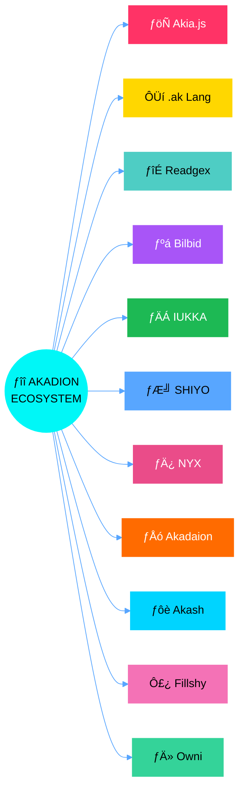
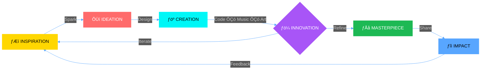

<!-- ===== AURORA HERO ===== -->
<picture>
  <source media="(prefers-color-scheme: dark)" srcset="https://raw.githubusercontent.com/iakadion/iakadion/main/assets/hero-dark.svg">
  
</picture>

 

 

<!-- ===== STATUS BADGES ===== -->

<!-- ===== SECTION DIVIDER ===== -->

<!-- ===== BENTO GRID: ABOUT ===== -->

## Ôùê ­Øù¬­Øùø­Øùó ­Øù£­Øùª ­ØùÜ­Øùÿ­Øùí­Øùø­Øùó ­Øùö­Øù×­Øùö­Øùù­Øù£­Øùó­Øùí? Ôùê

  <b style="color: #00f7f7; font-size: 1.1rem;">­ƒÄÁ MUSIC UNIVERSE</b>
   
  Musician & Artist ┬À Lyricist & Songwriter ┬À Audio Engineer ┬À Music Producer

  <b style="color: #58a6ff; font-size: 1.1rem;">­ƒÆ╗ TECH DIMENSION</b>
   
  Full-Stack Developer ┬À Tool & Language Builder ┬À AI Integrator ┬À App Creator

  <b style="color: #ff6b6b; font-size: 1.1rem;">­ƒÄ¿ CREATIVE REALM</b>
   
  Filmmaker & Director ┬À Visual Designer ┬À Writer & Storyteller ┬À Game Developer

  <b style="color: #ffd700; font-size: 1.1rem;">­ƒÜÇ INNOVATION LAB</b>
   
  Inventor & Architect ┬À Visionary & Futurist ┬À Experimenter ┬À Systems Designer

<!-- ===== BENTO GRID: ECOSYSTEM ===== -->

## Ôùê ­Øùº­Øùø­Øùÿ ­Øùö­Øù×­Øùö­Øùù­Øù£­Øùó­Øùí ­Øùÿ­Øùû­Øùó­Øùª­Øù¼­Øùª­Øùº­Øùÿ­Øùá Ôùê

<!-- ===== PROJECTS ===== -->

## Ôùê ­Øùƒ­Øùÿ­ØùÜ­Øùÿ­Øùí­Øùù­Øùö­ØùÑ­Øù¼ ­Øùú­ØùÑ­Øùó­ØùØ­Øùÿ­Øùû­Øùº­Øùª Ôùê

  <b style="color: #ff3366; font-size: 1.2rem;">­ƒöÑ Akia.js</b>
  Universal Singleton Renderer
  

    

  

  95%
   
  JS ┬À ESNext ┬À Transpiler ┬À Compiler

  <b style="color: #ffd700; font-size: 1.2rem;">ÔÜí .ak Language</b>
  Proprietary Web Language
  

    

  

  88%
   
  Compiler Design ┬À Native Language

  <b style="color: #4ecdc4; font-size: 1.2rem;">­ƒîÉ Readgex</b>
  Intelligent AI Browser
  

    

  

  82%
   
  React ┬À TS ┬À AI ┬À Autonomous Agent

  <b style="color: #a855f7; font-size: 1.2rem;">­ƒºá Bilbid</b>
  Semantic Knowledge Engine
  

    

  

  87%
   
  AI ┬À NLP ┬À Wikipedia API ┬À Knowledge Graph

  <b style="color: #1DB954; font-size: 1.2rem;">­ƒÄÁ IUKKA Player</b>
  Quantum Streaming Platform
  

    

  

  76%
   
  WebRTC ┬À Media APIs ┬À Streaming ┬À Audio Engine

  <b style="color: #58a6ff; font-size: 1.2rem;">­ƒÆ╝ SHIYO</b>
  Social Media Portfolio Platform
  

    

  

  70%
   
  React ┬À Node.js ┬À Social Integration

  <b style="color: #EA4C89; font-size: 1.2rem;">­ƒÄ¿ NYX</b>
  Creative Portfolio Showcase
  

    

  

  65%
   
  React ┬À WebGL ┬À 3D Graphics ┬À GLSL

  <b style="color: #FF6B00; font-size: 1.2rem;">­ƒÅó Akadaion</b>
  Institutional HQ
  

    

  

  80%
   
  Next.js ┬À TypeScript ┬À Enterprise

  <b style="color: #00D4FF; font-size: 1.2rem;">­ƒôè Akash</b>
  Universal Dashboard
  

    

  

  73%
   
  Dashboard ┬À Admin Panel ┬À Analytics

  <b style="color: #F472B6; font-size: 1.2rem;">Ô£¿ Fillshy</b>
  Background AI Content Generator
  

    

  

  68%
   
  AI ┬À Content Generation ┬À NLP

  <b style="color: #34D399; font-size: 1.2rem;">­ƒÄ» Owni</b>
  Component & Icon Library
  

    

  

  60%
   
  Web Components ┬À SVG ┬À Design System

<!-- ===== TECH ARSENAL ===== -->

## Ôùê ­Øùº­Øùÿ­Øùû­Øùø ­Øùö­ØùÑ­Øùª­Øùÿ­Øùí­Øùö­Øùƒ Ôùê

 

 

<!-- ===== STATS ===== -->

## Ôùê ­Øùû­ØùÑ­Øùÿ­Øùö­Øùº­Øùó­ØùÑ ­Øùª­Øùº­Øùö­Øùº­Øùª Ôùê

  

    
  

  

    
  

  

  

 

<!-- ===== WORKFLOW ===== -->

## Ôùê ­Øù¬­Øùó­ØùÑ­Øù×­ØùÖ­Øùƒ­Øùó­Øù¬ ÔƒÉ ­Øùú­Øùø­Øù£­Øùƒ­Øùó­Øùª­Øùó­Øùú­Øùø­Øù¼ Ôùê

<pre style="background: #0d1117; border: 1px solid rgba(0,247,247,0.2); border-radius: 12px; padding: 1rem; max-width: 720px; margin: 1rem auto; text-align: left; font-family: 'JetBrains Mono', monospace; font-size: 0.85rem; color: #c9d1d9; overflow-x: auto;">
const genho = new MultidimensionalCreator({
  domains: ["Code", "Music", "Film", "Design", "Writing", "Games"],
  philosophy: "Every pixel, every note, every line of code tells a story",
  mission: "Bridge the gap between art and technology",
  fuel: "Ôÿò Coffee ├ù Ôê×",
});

while (genho.isAlive) {
  const idea = await genho.dream();
  const creation = await genho.build(idea);
  await genho.shareWithTheWorld(creation);
  await genho.evolve();
}
</pre>

<!-- ===== CONNECT ===== -->

## Ôùê ­Øùû­Øùó­Øùí­Øùí­Øùÿ­Øùû­Øùº ­Øù¬­Øù£­Øùº­Øùø ­Øùá­Øùÿ Ôùê

 

<b style="color: #00f7f7; font-size: 1rem;">­ƒÄÁ ­Øùª­Øùó­Øù¿­Øùí­Øùù ÔƒÉ ­ØùÖ­ØùÑ­Øùÿ­Øùñ­Øù¿­Øùÿ­Øùí­Øùû­Øù¼</b>
 

  

<b style="color: #58a6ff; font-size: 1rem;">­ƒô▒ ­Øùª­Øùó­Øùû­Øù£­Øùö­Øùƒ ÔƒÉ ­Øùá­Øùÿ­Øùù­Øù£­Øùö</b>
 

  

<b style="color: #a855f7; font-size: 1rem;">­ƒÆ╗ ­Øùû­Øùó­Øùù­Øùÿ ÔƒÉ ­Øùù­Øùÿ­Øù®</b>
 

  

<b style="color: #ff6b6b; font-size: 1rem;">­ƒÄ¿ ­Øùû­ØùÑ­Øùÿ­Øùö­Øùº­Øù£­Øù®­Øùÿ ÔƒÉ ­Øù¬­ØùÑ­Øù£­Øùº­Øù£­Øùí­ØùÜ</b>
 

  

<b style="color: #ffd700; font-size: 1rem;">­ƒÜÇ ­Øùª­Øù¿­Øùú­Øùú­Øùó­ØùÑ­Øùº ÔƒÉ ­Øùû­Øùó­Øùí­Øùº­Øùö­Øùû­Øùº</b>
 

<!-- ===== CONTRIBUTIONS ===== -->

## Ôùê ­Øùû­Øùó­Øùí­Øùº­ØùÑ­Øù£­Øùò­Øù¿­Øùº­Øù£­Øùó­Øùí­Øùª Ôùê

  

## Ôùê ­Øùö­Øùû­Øùø­Øù£­Øùÿ­Øù®­Øùÿ­Øùá­Øùÿ­Øùí­Øùº­Øùª Ôùê

  

<!-- ===== FOOTER ===== -->

 
<b style="color: #00f7f7;">Let's connect and create something extraordinary together!</b> 

  

 

  

<!-- ===== VISIT MY WEBSITE ===== -->

<pre style="color: #555; font-size: 0.75rem; margin-top: 1rem;">
ÔÜí Built with passion ÔÇó Powered by creativity ÔÜí
</pre>

